# Exercise 1 - Generating an SAP Fiori Elements App

In this exercise, you will create a **SAP Fiori elements** application of type **List Report Object Page**, based on the given
SAP Cloud Application Programming Model sample service.
For this you will make usage of the **SAP Fiori tools Application Generator**.

## Exercise 1.1 Using the SAP Fiori tools Application Generator

In the **SAP Business Application Studio**, the **Welcome page** is shown.

\(1\) Click **Start from template** .


If the Welcome page is not shown, you can start the **Template Wizard** via the Command Palette
(menu View -\>Find Command... or ctrl+shift+p(Win)/cmd+shift+p(Mac))\
In the search field, type **Open Template Wizard**.\
Choose the corresponding list entry.

\(2\) Click on tile **SAP Fiori application**.

\(3\) Click .

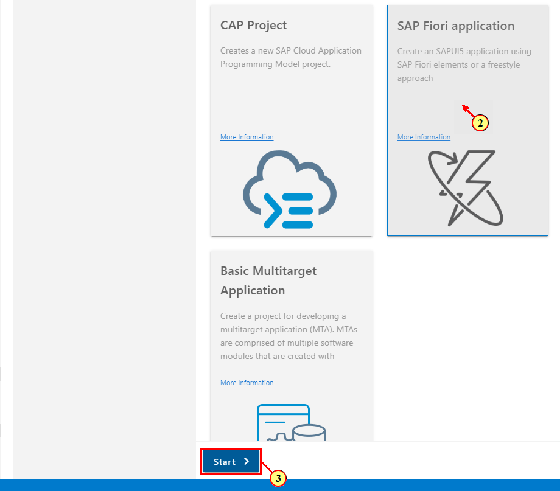

\(4\) In the wizard step **Floorplan Selection**, click on the tile **List Report Object Page**.

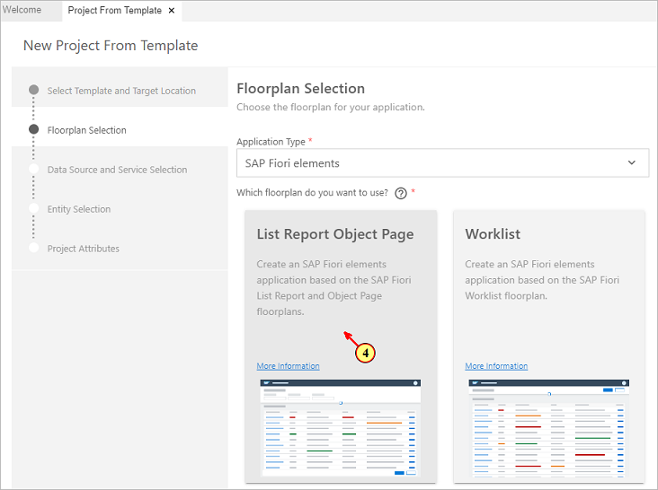

\(5\) Click .

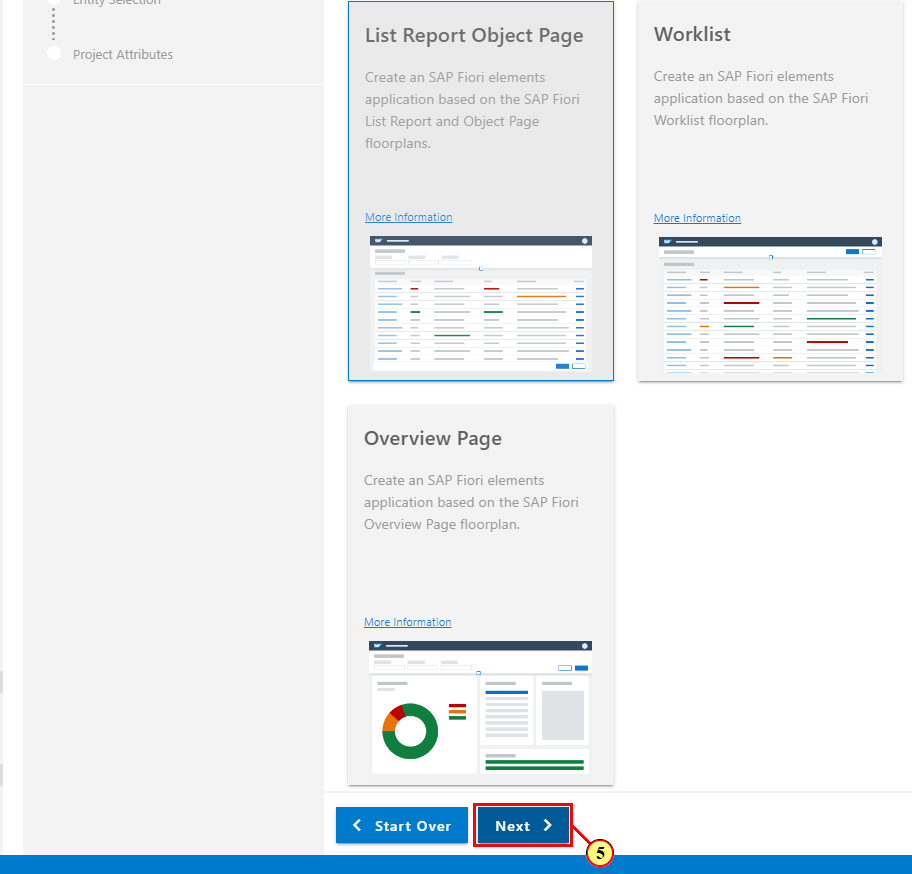

In the wizard step **Datasource and Service Selection**, click \(6\).

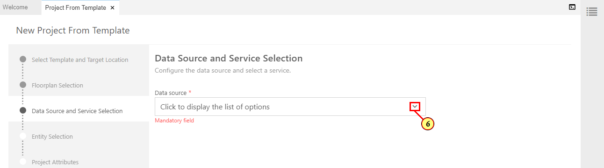

\(7\) Select  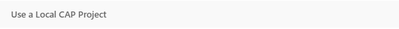.

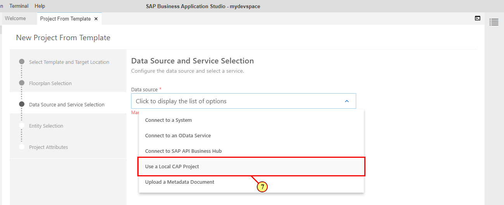

\(8\) Click the **Browse for folder** icon to select your projects folder.

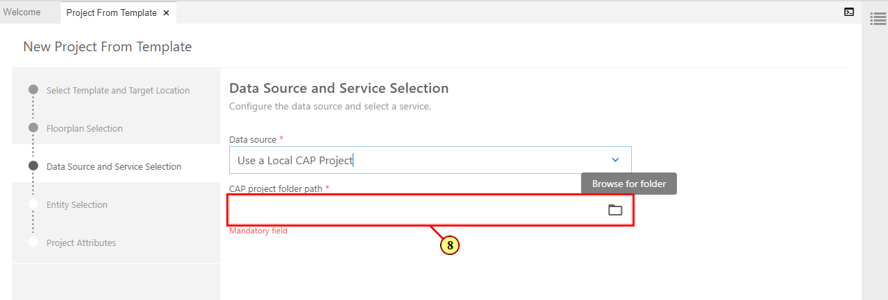

\(9\) Select folder **teched2021-IIS160** and click .

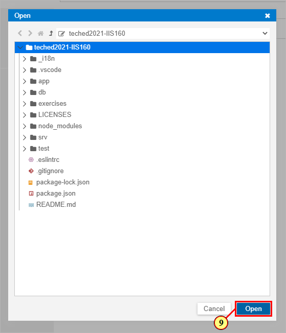

\(10\) Click  to open the OData service drop-down.

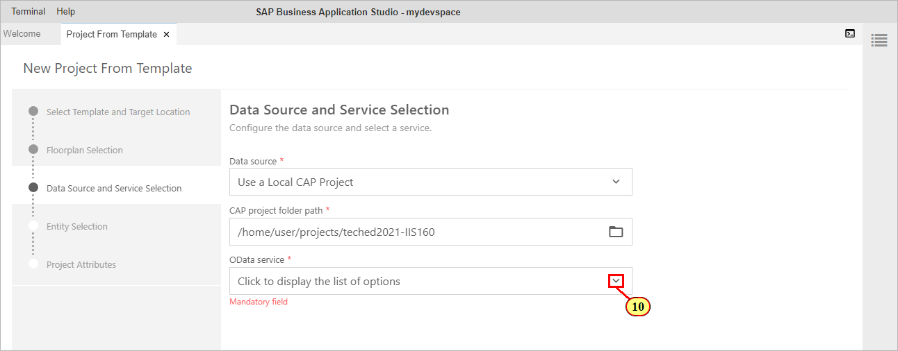

\(11\) Select  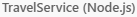.

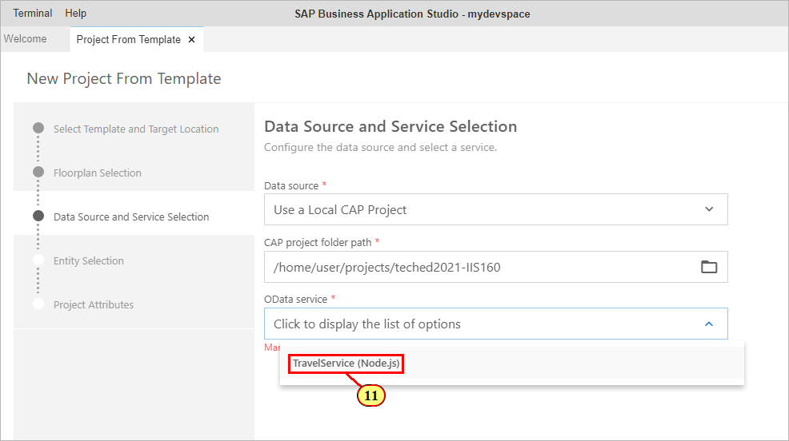

\(12\) Click .

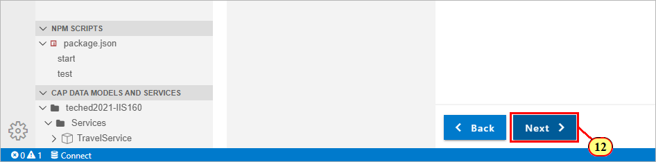

\(13\) In the wizard step **Entity Selection**, open drop-down **Main Entity**, and select **Travel**.\
The properties of this entity will be used for display of data on List Report, showing data from the entity collection.

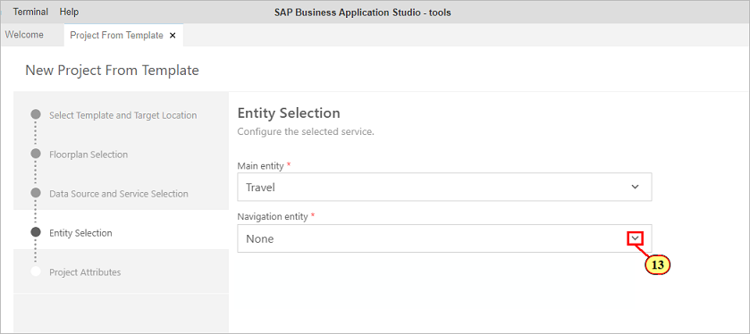

\(14\) Open drop-down **Navigation Entity**, and select **to_Booking**.\
This will add an additional routing target allowing navigation from the object page to an additional sub object page.

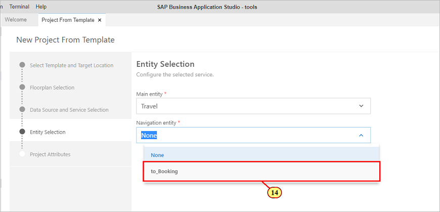

\(15\) Click .

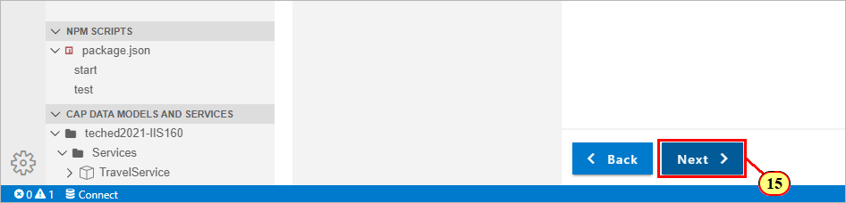

In the wizard step **Project Attributes**, add the following attributes to the application project:

- **Module Name**: managetravels\
(module name has to match exactly for some of the subsequent exercises to work properly)

- **Application Title**: Manage Travels\
(or a title by your choice)

- **Application Namespace**: sap.fe.cap\
(namespace has to match exactly for some of the subsequent exercises to work properly)

\(16\) Select **Yes** in order to configure advanced options.

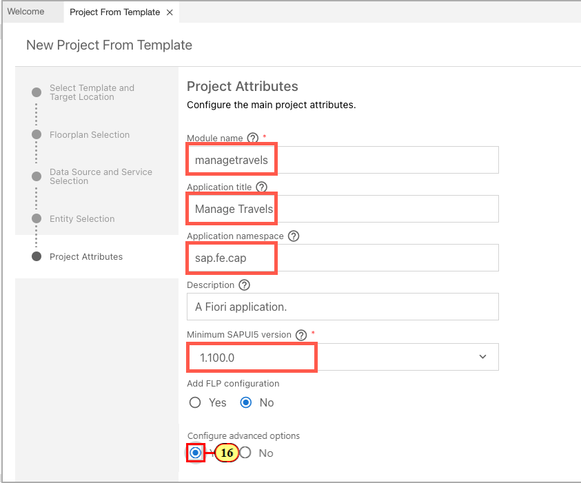

\(17\) Click to open the drop-down **UI5 version**.

\(18\) Select version **1.96.0**.
Please note: in order to have some of the subsequent exercises working properly, don't choose **Latest** as UI5 version since it might still point to a version below 1.96.0 during TechEd2021.


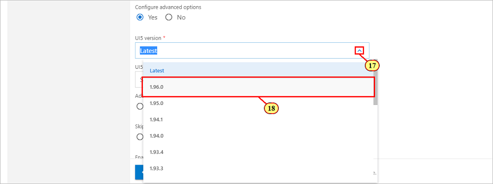

\(19\) Select **Yes** in order to skip generation of an additional associated annotation.cds file.
The sample service already provides a basic set of UI annotations with file app/layouts.cds.

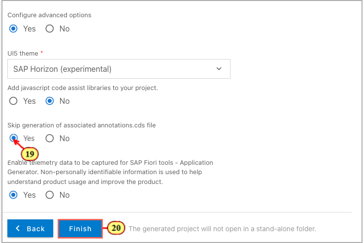

\(20\) Click  .\
This will start the app generation.\
When finished, you can review the generated artifacts in the **Explorer** pane of SAP Business Application Studio.\
The generated artifacts are located in folder **app/managetravels** (the path reflects the module name you have entered during app generation).

## Exercise 1.2 Adding an App Preview Script

Besides the common way of starting a CAP service via **cds watch**, another convenient way to start the service and app at the same time is to add an additional **npm script** to file **package.json** of the root folder.\
In **exercises 4 ff.**, we will extend the app based on **xml fragments**. We need to make sure that the browser view cache is deactivated during testing our development, so that changes applied to the xml fragments get properly updated when refreshing the UI.\
(21) Open file **package.json** of the root folder.\
(22) Scroll to section **scripts**, put a comma at the end of the last script line, and press enter to make a new line.\
Enter the following script:

```js
    "watch-managetravels": "cds watch --open managetravels/webapp/index.html?sap-ui-xx-viewCache=false#fe-lrop-v4" 
```

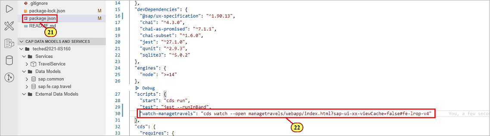

Please note the additional parameter **sap-ui-xx-viewCache=false** added to the app start Url.
## Exercise 1.3 Starting the App

After completing these steps you will have started and tested the generated app.

Instead of using **cds watch** in the terminal in order to start the service, we will use the new script we have added to file **package.json** for that purpose.\
If **cds watch** is already running in a terminal, please end it by pressing keyboard keys **control+c**, otherwise the default port 4004 will already be in use by the existing server process.

\(23\) Click **Preview Application** on tab **Application information** that is automatically displayed after app generation.\
Alternatively, you can select **Preview Application** via the context menu of the app folder.

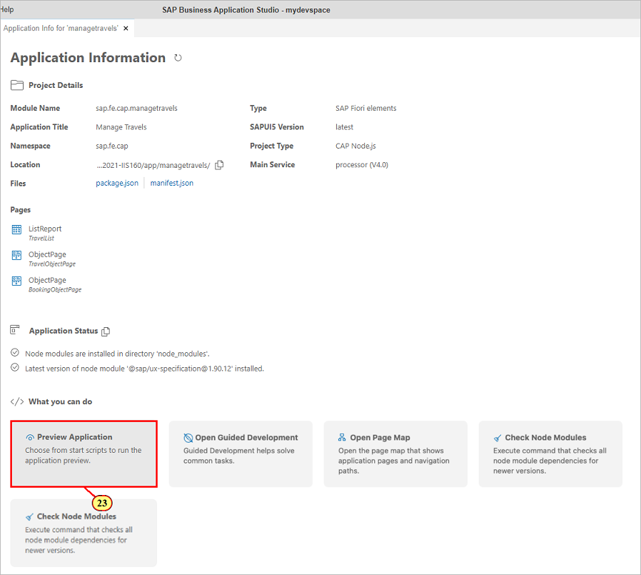

This opens a drop-down at the top offering all **cds run** and **cds watch** based scripts maintained in the scripts section of file **package.json**.

\(24\) Select the start script **watch-managetravels** we have added to the package.json. This runs the service and automatically starts the Fiori application.

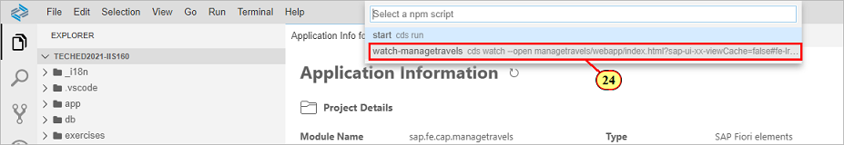

\(25\) On the List Report page of the Fiori application, click  to trigger selection.

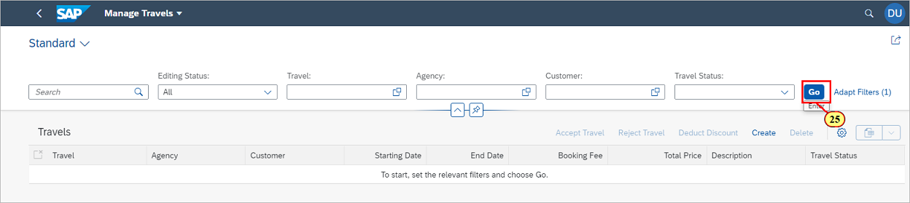

Make yourself familiar with the application:

- on the List Report, use the **selection fields** to set a filter
- Click on a list item to **navigate** to the object page
- Click on **Edit** on the object page to create a **draft version** of the displayed object and to set the UI to edit mode.
- Change the value of an input field to automatically **update the draft** when input field focus is changed, or when you navigate back to the List Report.
- The draft is saved back to the active instance by pressing **Save** on the bottom of the Object Page.

## Summary

You've now successfully generated and tested the Fiori elements app.

Continue to - [Exercise 2 - Configuring the UI by Using the SAP Fiori tools Page Map](../ex2/README.md)
