# Exercise 2 Enhancing the UI by Using the SAP Fiori tools Page Map

In this exercise, you will learn how to use some of the new configuration features provided by the **SAP Fiori tools Page Map**.
## Exercise 2.1 Enable Data Load During Start of the App

When starting the app, per default the user has to press the
**Go** button in order to trigger the selection.\
This allows defining filters before the query is executed.\
The default behaviour can be changed in a way that selection is immediately
triggered when the app is started.

In the SAP Business Application Studio, open the SAP Fiori Page Map by clicking on tile (1) of the **Application Info** tab.

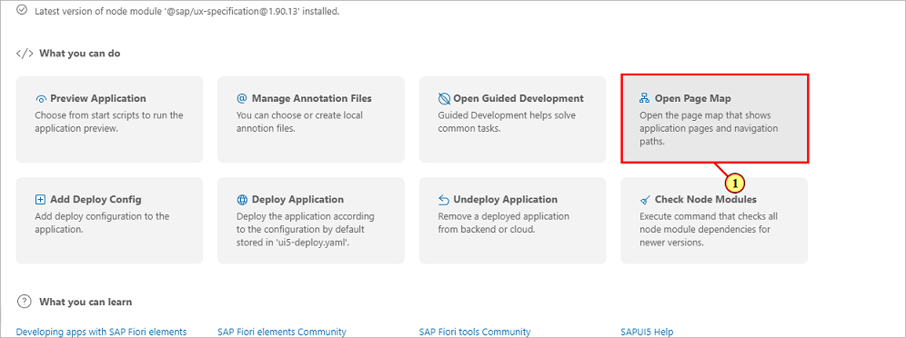

Alternatively, you can open the Page Map via context menu on project's folder **app** or via **View -> Command Palette...Fiori: Show Page Map**).

\(2\) On the tile **List Report**, click icon **Configure Page**.

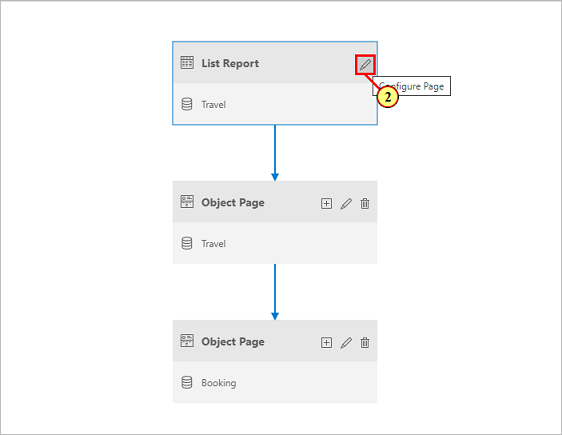

\(3\) In the page editor, click  .

\(4\) In the drop-down box **Initial Load**, select **Enabled**.\
The configuration is automatically saved.

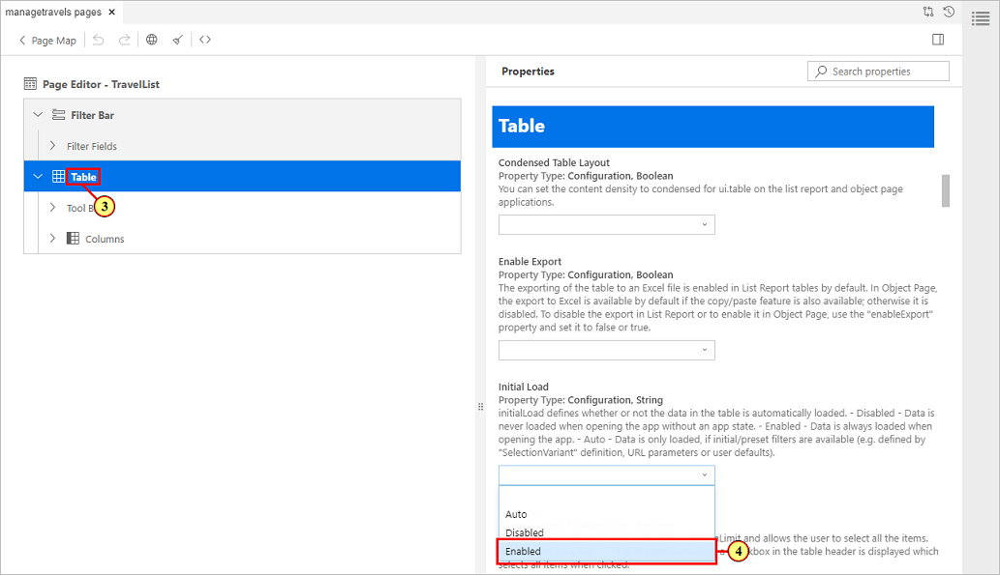

Switch to the preview browser tab. After a couple of seconds, the app should reload automatically.\
Data will now be immediately loaded in the List Report page when starting the app.

\(5\) In the List Report, we can see that in case of small screen resolution, column **Travel Status**  is currently only shown when toolbar button **Show Details** is pressed.\
As status information is considered as being important, let us change its sequence in the next exercise.

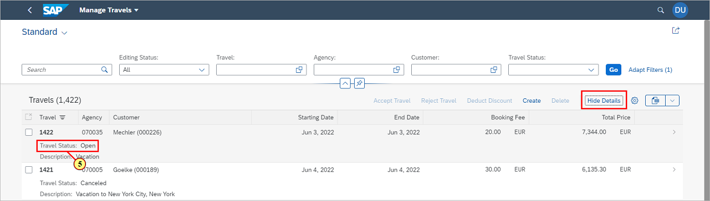

## Exercise 2.2 Change Sequence of a Table Column in the List Report

\(6\) Switch back to the Page Editor and expand section **Columns**.

Drag column **Travel Status** \(7\) and drop it in between columns **Travel** and **Agency** \(8\).

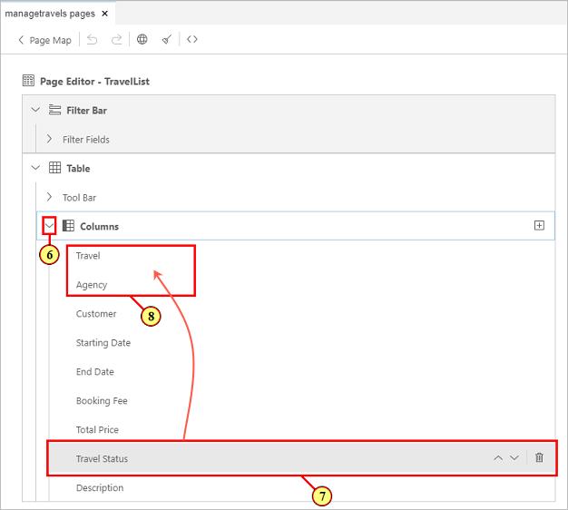

## Exercise 2.3 Adding Criticality to a Table Column

It is considered as best practice providing a criticality color for status information displayed on the UI.\
For column **Travel Status**, we will now configure this via the Page Map.\
The service model's entity **Travel** already contains property **criticality** in file **db/schema.cds**:

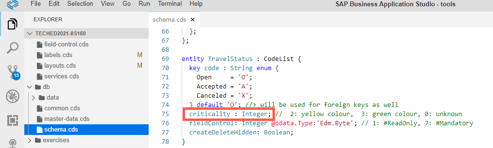

\(9\) Select column **Travel Status** in the page editor's section **Columns**.

\(10\) In the properties pane, expand drop-down box **Criticality**.

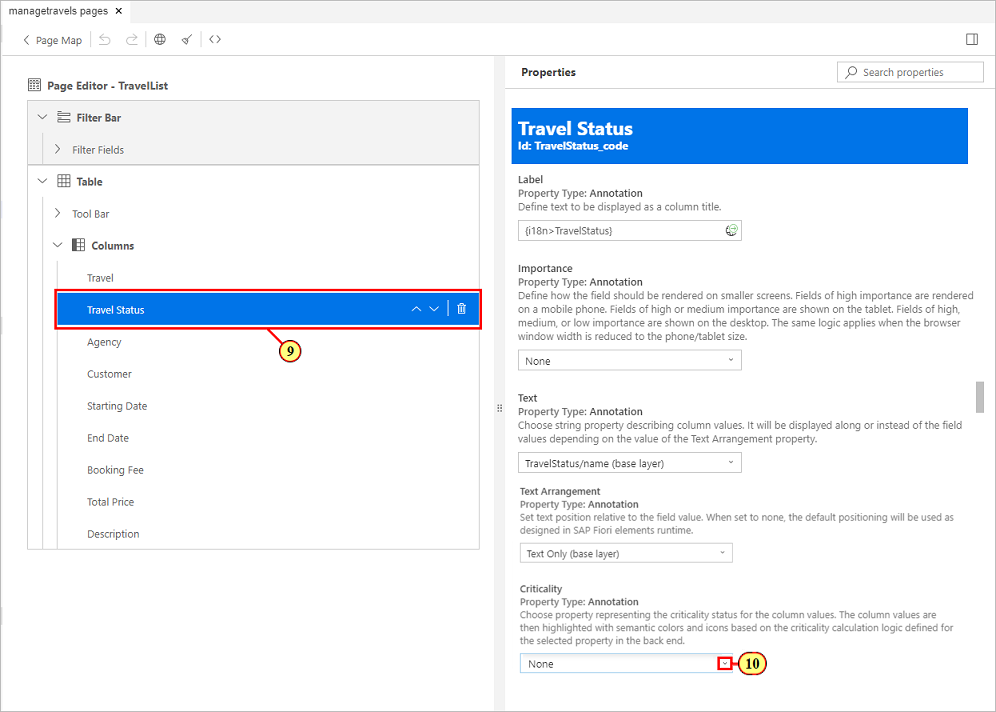

\(11\) Select list entry **TravelStatus/criticality**.  

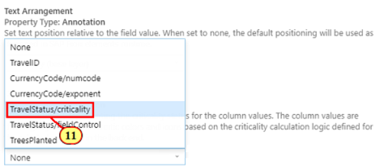.

## Exercise 2.4 Adding Text and Text Arrangement to a Field
In the List Report, we can see that column **Agency** is only showing the identifier, not the agency name.

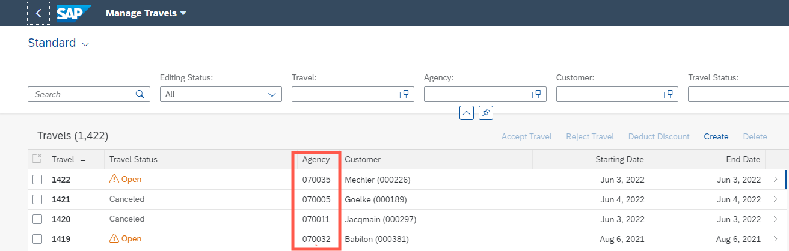

We will now configure the **display text** and the **text arrangement** in order to show the agency name along with the identifier.

\(12\) Select column **Agency** in the page editor's section **Columns**.

\(13\) In pane **Properties**, scroll to property **Text** and expand the drop-down box.

\(14\) Select entry 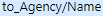.

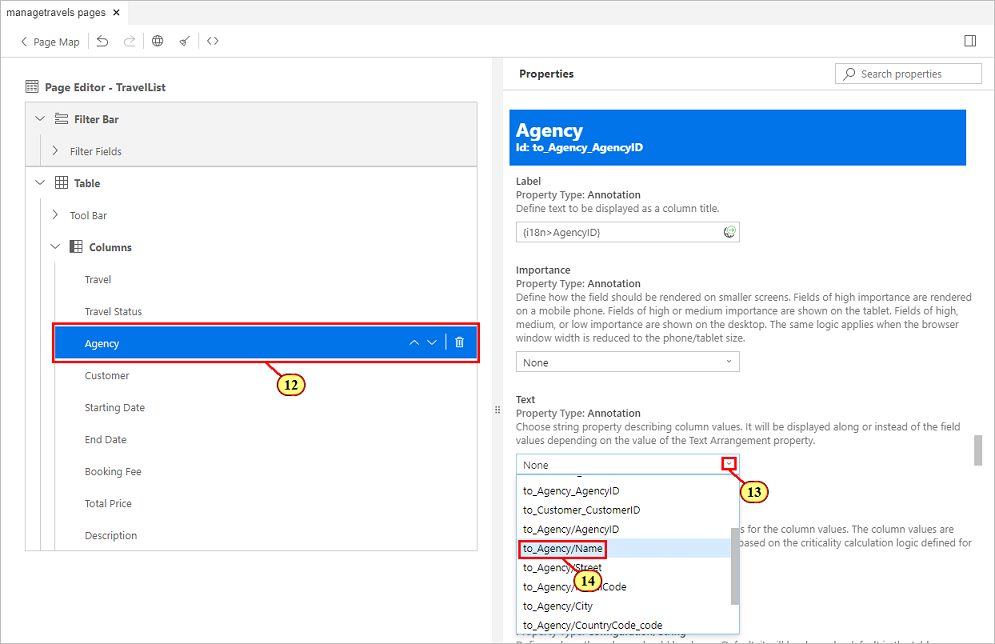

An additional property **Text Arrangement** is now shown in the properties pane.\
\(15\) Expand the drop-down box.

\(16\) Make sure that list entry  **Text First** is selected.\
With it, column **Agency** will show values in format **<display text\> (<identifier\>)**.

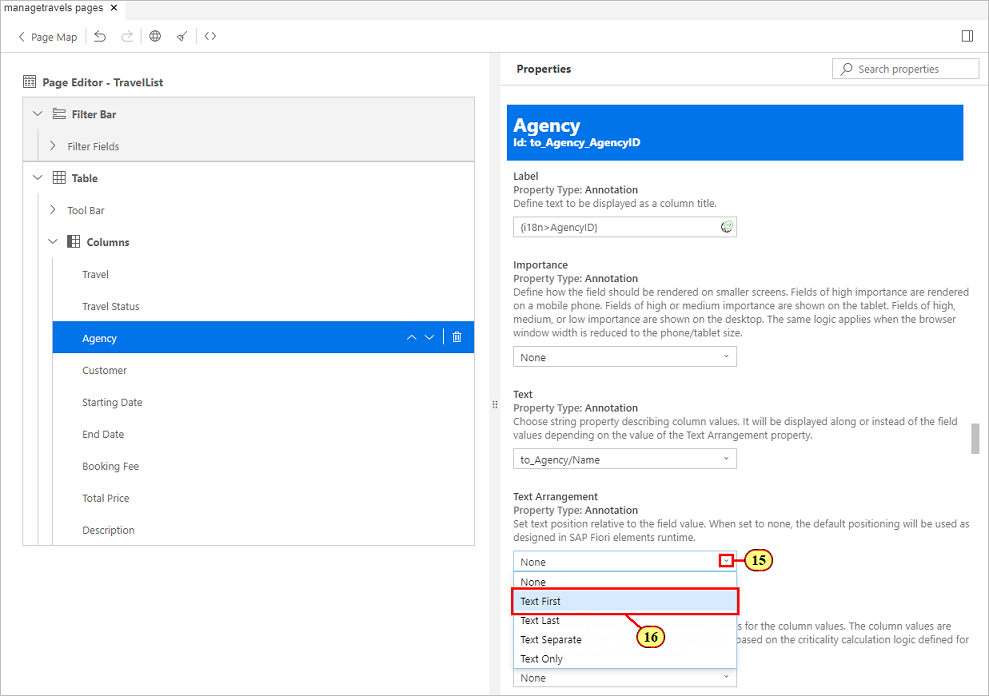

Switch to the preview browser tab.

\(17\) Column **Travel Status** is now being displayed with criticality coloring at its new position in the table.

\(18\) Column **Agency** is now displayed with the configured text arrangement.

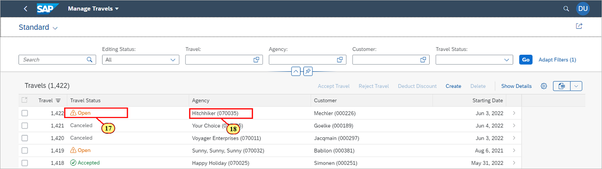

## Exercise 2.5 Change Form Field Order and Display Type

On the object page, in field group **Travel** we want to exchange the positioning of fields **Customer** and **Agency**.\
For Field **Description**, in order to have long descriptions properly displayed in edit mode, we will switch the field's display type by using the SAP Fiori tools Page Map.

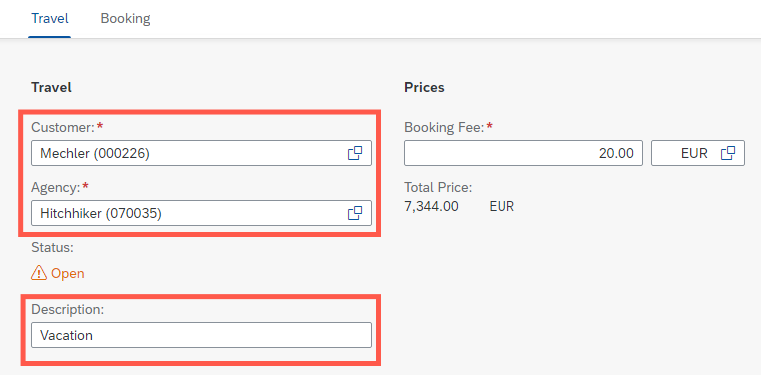

\(19\) In the Page Editor, click on 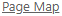.

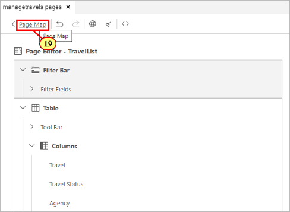

\(20\) On the **Object Page** tile, click icon **Configure Page** .

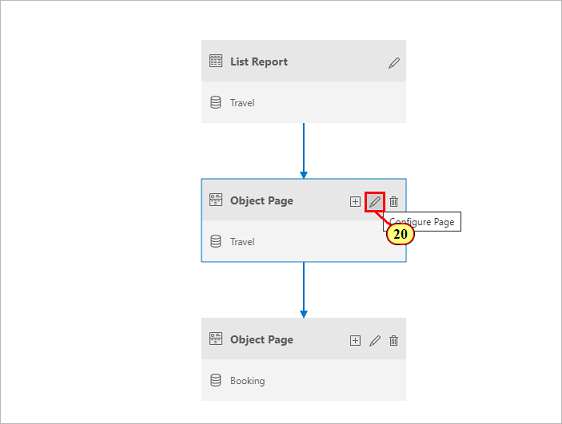

\(21\) Expand section **Sections->Travel->Subsections->Travel->Form->Fields**.

\(22\) At field **Agency**, click icon **Move Up**  in order to exchange its position with field **Customer**.\
Alternatively, you can also use **drag & drop**.

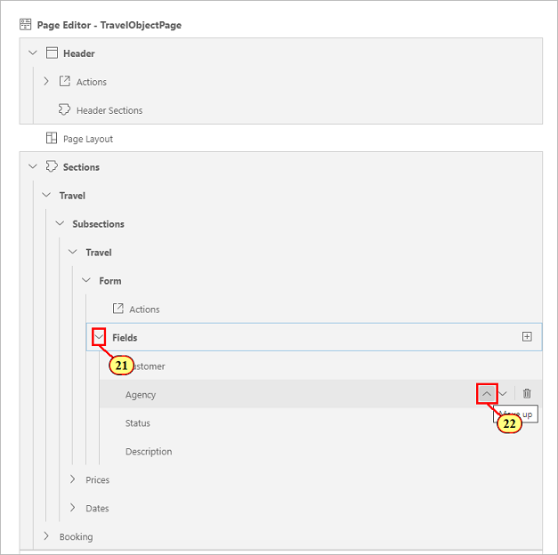

Now let's switch the display type for field **Description**.

\(23\) Select field **Description**.

\(24\) In pane **Properties**, open the drop-down box for property **Display Type** and select list entry **Text Area**.

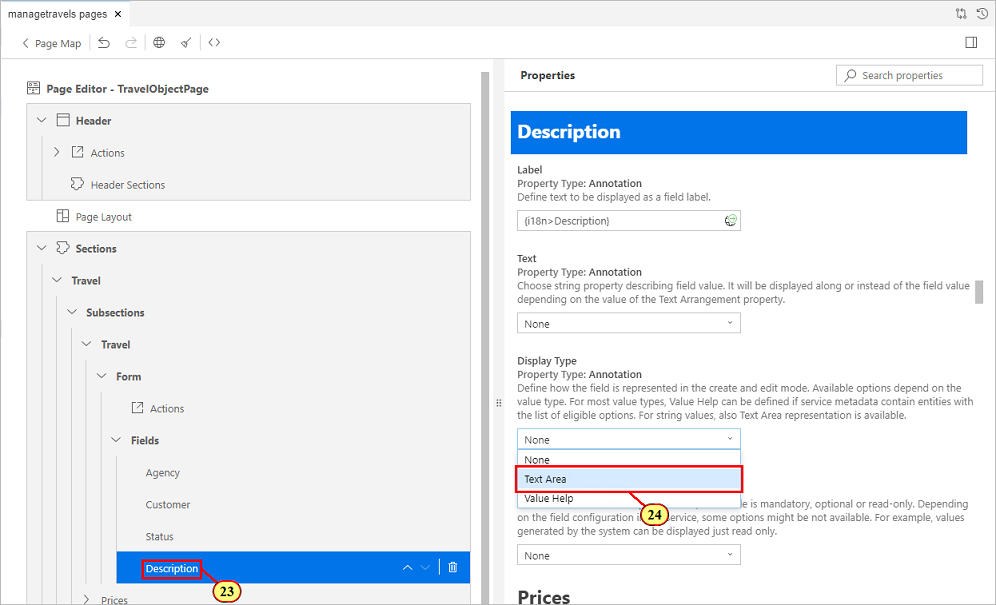

 Switch to the preview browser tab.\
\(25\) On the object page, click button .

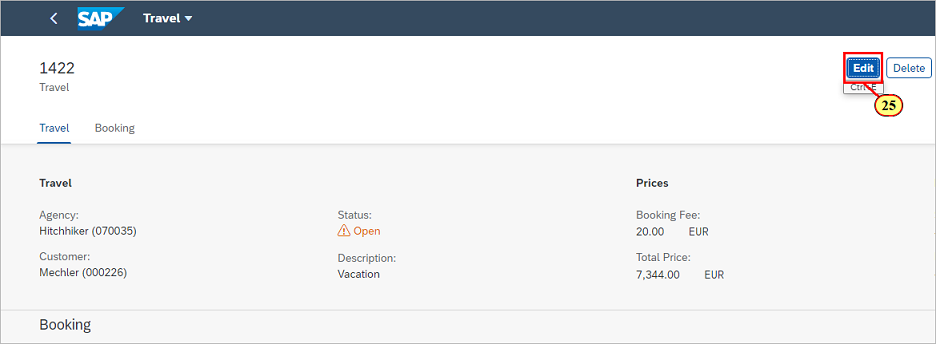

\(26\) Field **Description** is now shown as a **text area**, and the position of fields **Agency** and **Customer** has changed.

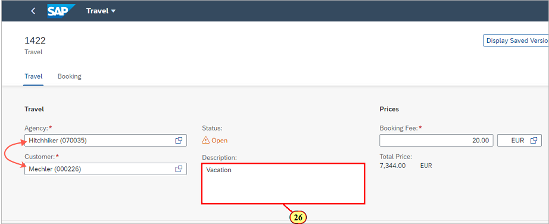

Click button  in order to switch back to display mode.

## Exercise 2.6 Adding a new Field Group

For a **sustainability initiative**, the travel service has been extended to provide some additional fields for the new green flight offering which are not yet shown in the UI.\
In this exercise, we will add a new **subsection Sustainability** to section **Travel** of the object page by using the **Add Form Section** functionality of the **SAP Fiori tools Page Map**.

\(27\) In the SAP Fiori tools Page Map's **page editor** for the object page,
expand **Page Layout - Sections - Travel - Subsections** and click icon **Add Sections** .

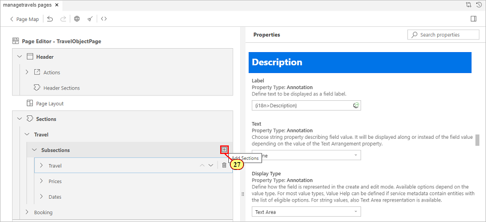

\(28\) Select list entry  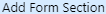. This opens up a **dialog**.

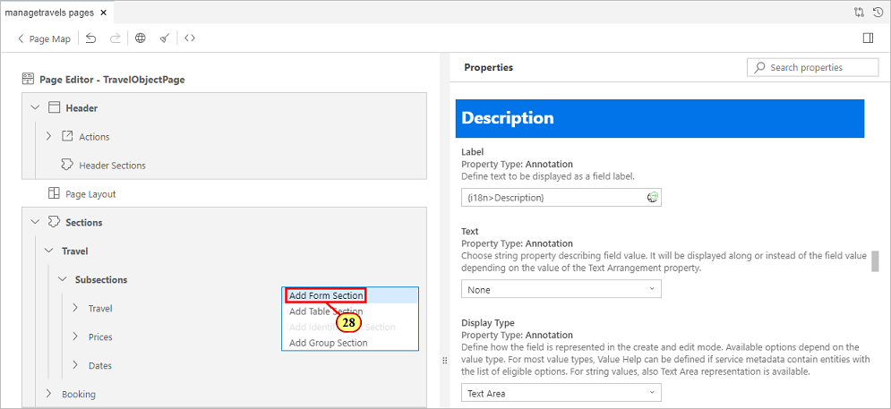

\(29\) In the dialog, enter label **Sustainability** and click icon  in order to substitute it with an **i18n text reference**.

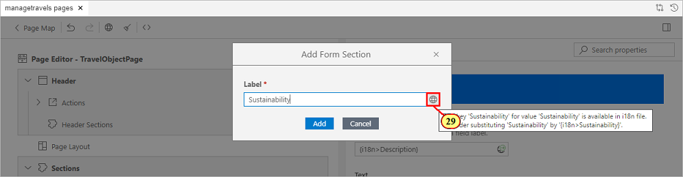

\(30\) Confirm text key substitution by clicking .

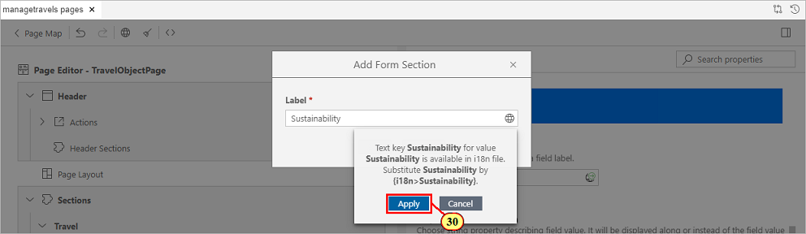

\(31\) Click button **Add** to complete the **Add Form Section** dialog.

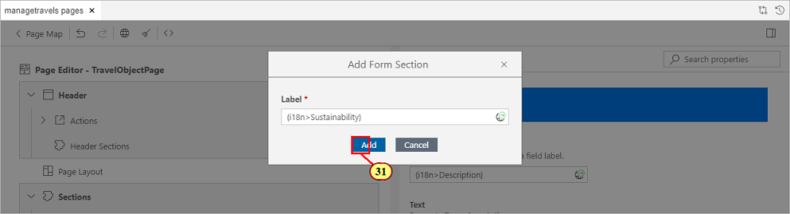

\(32\) Expand the form of the the new subsection **Sustainability** and click icon **Add Fields**  \(33\).

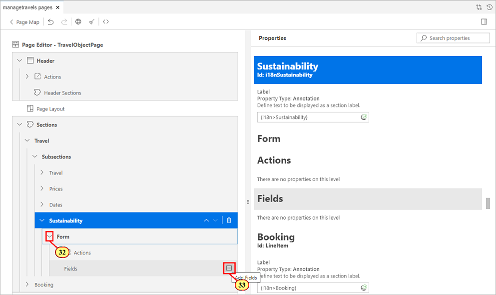

\(34\) In dialog **Add Fields**, expand drop-down box **Fields**.

\(35\) Select fields **GoGreen, GreenFee and TreesPlanted**.

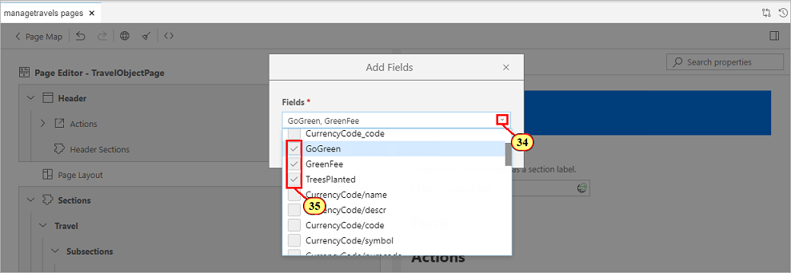

\(36\) Click button **Add** to complete the **Add Fields** dialog.

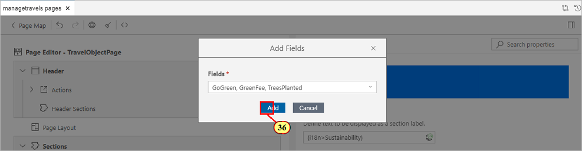

\(37\) Verify that the fields have been added to the new subsection.

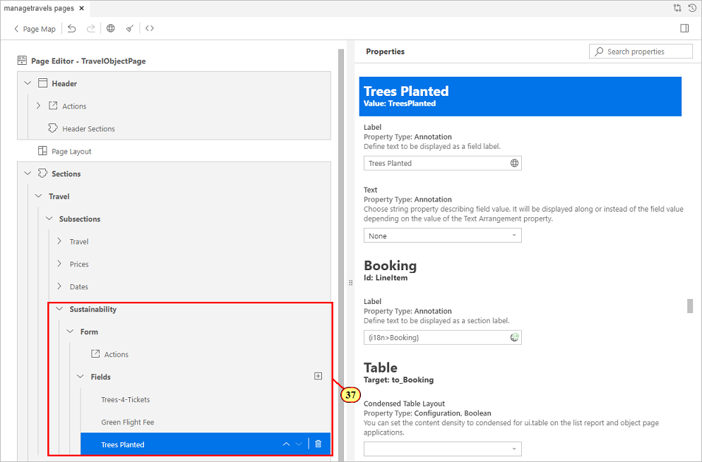

Switch to the preview browser tab. The new subsection **Sustainability** is shown on the object page.\
\(38\) Click  button 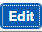.

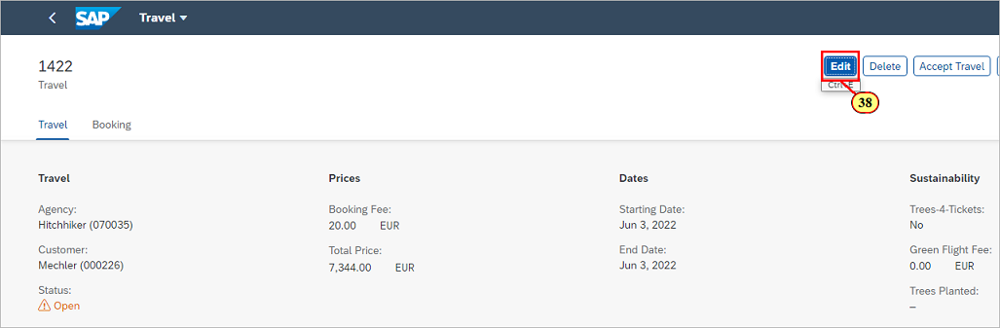

\(39\)  Select **Trees\-4\-Tickets** check box.

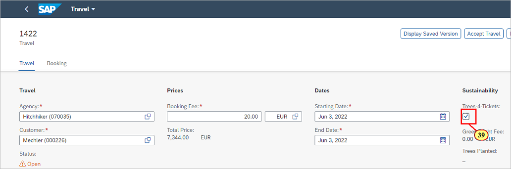

\(40\) Click button .

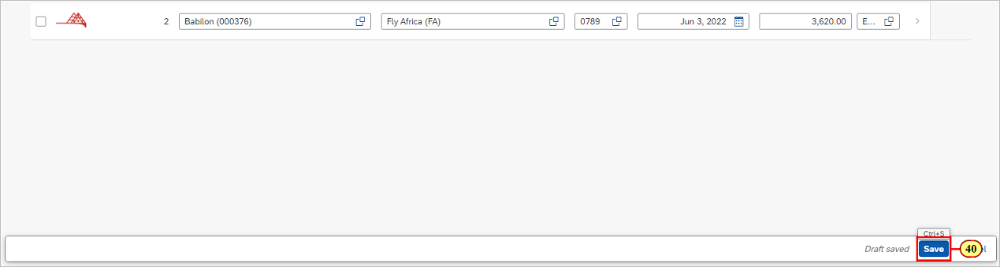

\(41\) With Trees-4-Tickets selected, fields Green Flight Fee and Trees Planted show calculated values after having saved changes.

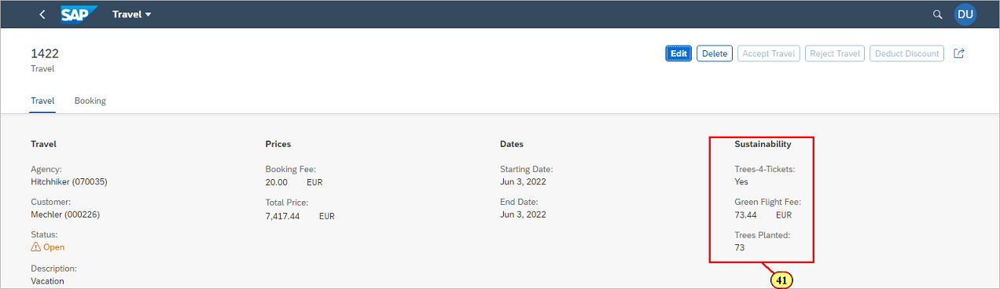

## Summary

By using the SAP Fiori Page Map, you've now configured **initial loading** during app start, changed the **position of a table column and a form field**,\
added **criticality coloring** to a table column, added **text** and **text arrangement** to the identifier field, and added a **new subsection**‚ to section Travel.

Continue to - [Exercise 3 - Fine-Tuning the UI](../ex3/README.md)