# Exercise 3 - Fine-Tuning the UI

In this exercise we will apply some fine-tuning to the UI in order to achieve a better **user experience**.

## Exercise 3.1: Add Table Line Criticality

In exercise 2.6 we have added an additional **subsection Sustainability** to the object page.\
By adding a **criticality** annotation to the bookings table, we can **highlight the table lines** when the Trees-4-Tickets checkbox is selected.

\(1\) Open file **app/layouts.cds** and scroll to section **Exercise 3.1: Add Table Line Criticality**\
\(2\) Enter the following code snippet:

```js
    ![@UI.Criticality]: criticality,
```

Please note the **specific CDS format** of the annotation **![@UI.Criticality]** put in brackets which is required since it is added inline to the **@UI.LineItem** annotation.

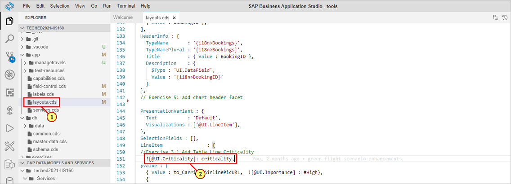

Switch the the preview browser tab and navigate to the object page.\
\(3\) Click  button .

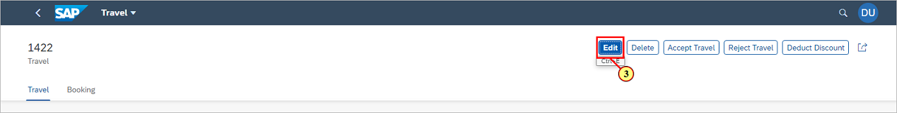

\(4\) Click checkbox  **Trees-4-Tickets**.

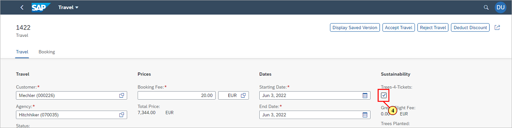

\(5\) Click  .

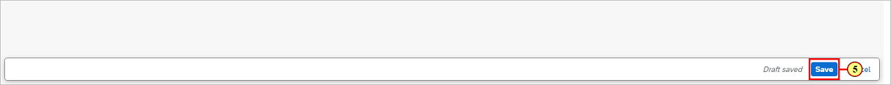

\(6\) The items of table **Bookings** now show a green color highlight at the beginning of the line.

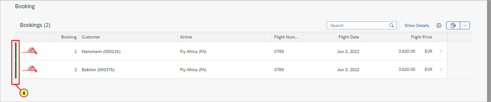

## Exercise 3.2: Adding a side effect to the Trees-4-Tickets property

When selecting the Trees-4-Tickets checkbox, the service backend calculates the values for properties **Green Flight Fee**, **Trees Planted**, and **Total Price**.\
The updated values are currently only shown on the UI after refreshing the UI manually or after having saved the changes.\
We will therefore add a side effect on property **GoGreen** of entity **Travel** in order to update the values immediately after the checkbox was clicked.\
Additionally, the side effect will trigger a **refresh to the bookings table** so that the table line highlighting is also immediately visible.

\(7\) Open file **app/field-control.cds** and scroll to section **Exercise 3.1: Add side effect on GoGreen property**.\
\(8\) Enter the following code snippet.

```js
annotate TravelService.Travel with @Common : {SideEffects : {
  $Type            : 'Common.SideEffectsType',
  SourceProperties : [GoGreen],
  TargetProperties : ['TotalPrice', 'GreenFee', 'TreesPlanted'],
  TargetEntities : [to_Booking]
}};
```

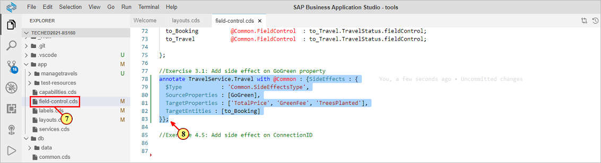

In **SourceProperties**, property **GoGreen** defines the trigger of the side effect.\
In **TargetProperties**, we list all properties that should immediately be refreshed.\
The property values are defined as Strings in that case, allowing to also define an asterisk '*' which allows refreshing all properties of the entity.\
In **TargetEntities**, we define association **to_Booking** which will refresh the data shown in table  **Bookings**.

Switch to the preview browser tab.

\(9\) With the object page in edit mode, select checkbox **Trees\-4\-Tickets**.


\(10\) Fields **Green Flight Fee** and **Trees Planted** are immediately updated.

\(11\) Field **Total Price** is also updated.

\(12\) Table **Bookings** immediately shows the line color highlighting.

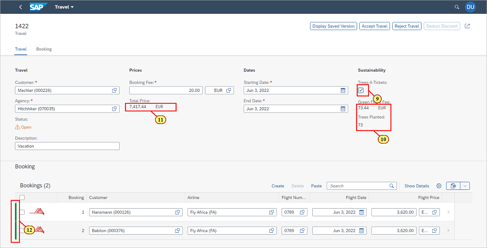

## Exercise 3.3: Adding a Semantic Key

Per default, in the browser Url a combination of the selected entity item key (TravelUUID in this case) and draft administrative property **IsActiveEntity** is shown.\
The Url changes when switching from display mode  to edit mode, by either referring to the active document \(13\) or the draft document \(14\).

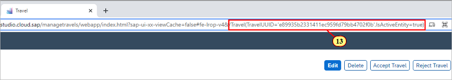

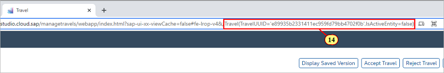

Furthermore, defining a semantic key additionally displays the corresponding List Report table column values in bold, and for unsaved items, a **draft indicator** is shown.

In order to get a stable Url that can be easily shared and which is also slightly better readable,\
we will define property **TravelID** as the semantic key of entity **Travel**.

Open file **app/Capabilities.cds** (15) and scroll to section **Exercise 3.2: Add Semantic key**.

(16) Enter the following code snippet:

```js
annotate TravelService.Travel with @Common.SemanticKey: [TravelID];
```

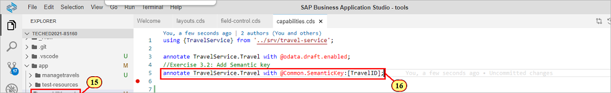

Switch to the preview browser tab and navigate from the list report to the object page.

\(17\) For the select travel, the semantic key is shown in the browser Url.

\(18\) Click button  to switch to edit mode.

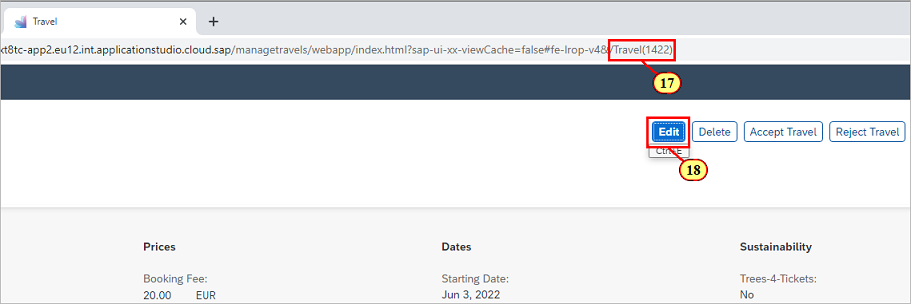

\(19\) The browser Url stays stable for both display and edit mode.

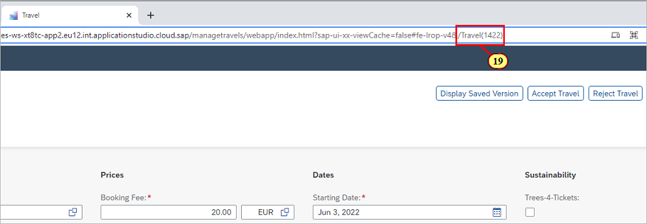

\(20\) Navigate back to the List Report.\
Column *Travel** now shows values in bold, and the **draft indicator** is shown.\
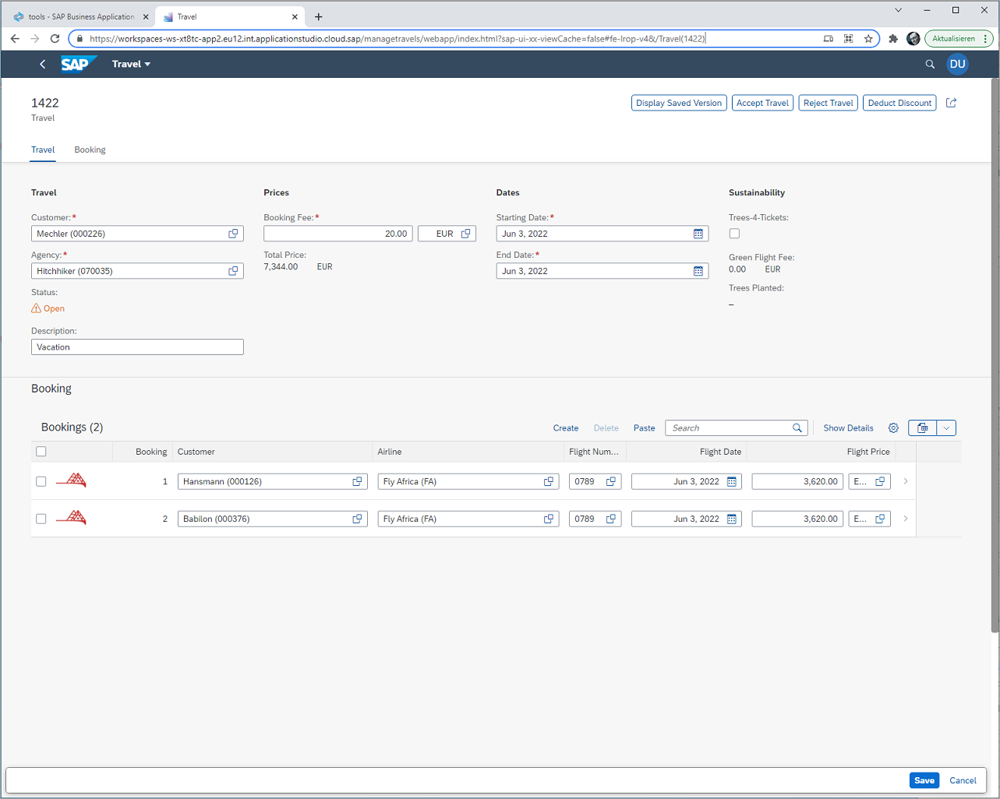

## Summary

We have learned how to add **criticality coloring to table lines**, how to define a **side effect** in order to have dependent data immediately refreshed during editing,
and how to make usage of the **semantic key** annotation in order to get a better readable Url and to highlight the corresponding table column values in the List Report.

Continue to - [Exercise 4 - Extending the App with Fiori Elements Building Blocks](../ex4/README.md)