# Exercise 4 - Flexible Programming Model: Extending the App with Fiori Elements Building Blocks

In this exercise, we will replace the object page table section **Bookings** with a **custom section** by using the **SAP Fiori tools Page Map**.\
In the custom section, we will combine **freestyle UI5 controls** with **SAP Fiori elements building blocks** offered by the **flexible programming model**.

## Flexible Programming Model Overview

SAP Fiori elements for OData V4 provides various ways to **extend applications** to your own particular needs.\
The flexible programming model makes this easy for you.\
While you're free to use any SAPUI5 coding or controls in **extension points**, you can also take advantage of our\
**building blocks** and **controller extensions**.\
SAP Fiori elements building blocks are **consistently orchestrated by the framework**, automatically benefiting\
from **SAP Fiori compliance** and standard application behavior like draft handling and side effects.\
In this exercise, we will combine UI5 freestyle controls with Fiori elements building blocks in a custom section.\
With the **table building block**, we get the same behaviour and looks of the replaced table section\
in a Fiori elements extension point freestyle context.

The [Flexible Programming Model Explorer](https://sapui5.hana.ondemand.com/test-resources/sap/fe/core/fpmExplorer/index.html#/buildingBlocks/buildingBlockOverview) provides further samples and code snippets,
showing how to properly use building blocks in SAP Fiori elements extension points.

## Exercise 4.1 Remove existing Section via Page Map

The **SAP Fiori tools Page Map** provides several ways of configuring the app and also allows to add and remove UI elements.\
\(1\) In the SAP Business Application Studio, click the corresponding tile on the **Application Info** tab in order to open the SAP Fiori tools Page Map.\
If closed, you can reopen the Application Info tab via menu **View->Find Command...->Fiori: Open Application Info**.

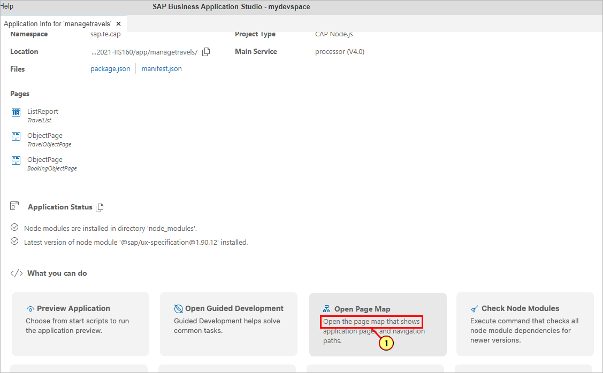

Alternatively, we can open the SAP Fiori tools Page Map via context menu on the folder **app** in the **Explorer** pane\
or via menu **View -> Find Command... -> Fiori: Show Page Map**

\(2\) On the SAP Fiori tools Page Map tile **Object Page**, click icon  (**Configure Page**).

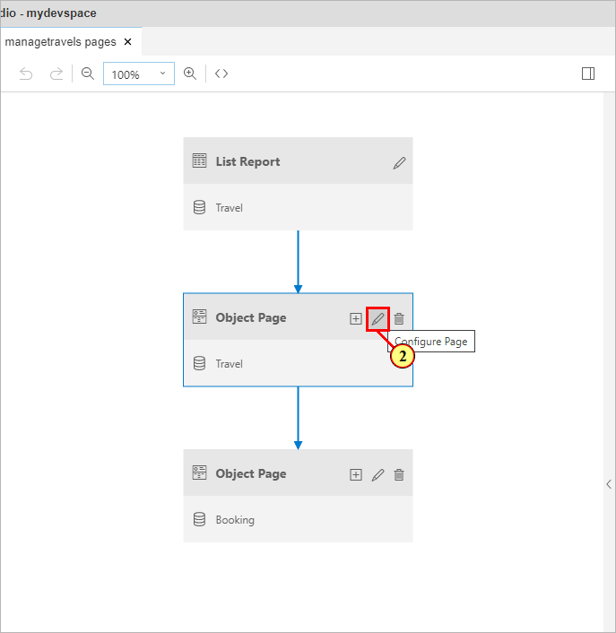

In the Page Editor -TravelObjectPage, expand **Sections**.\
\(3\) For section **Booking**, click icon (Delete).

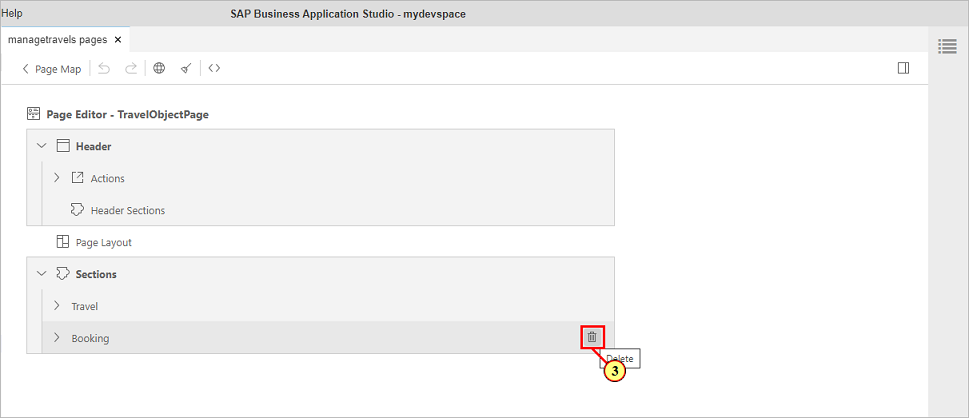

\(4\) In the dialog, confirm deletion by clicking button 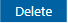.

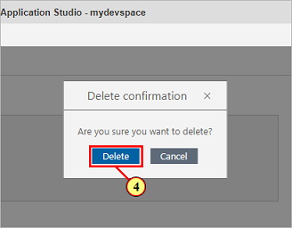

In the preview browser tab of the app, verify that the object page booking table section is not visible anymore.

## Exercise 4.2 Adding a Custom Section via Page Map

\(5\) In the Page Editor, click icon   (**Add Sections**) in the top right corner of area **sections**.

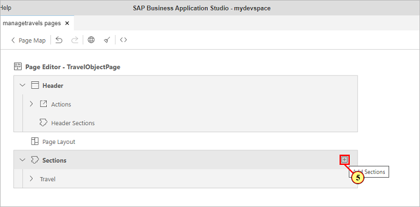

\(6\) In the combo box, select 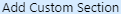.

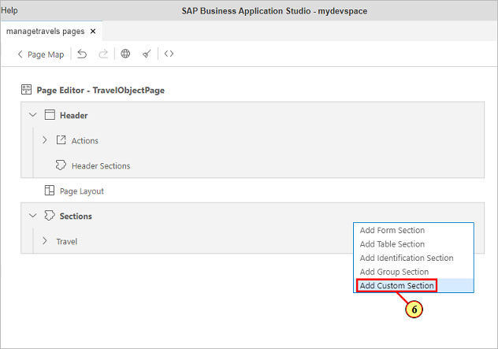

In the dialog **Add Custom Section**, enter  the following information:

- Id: **CustomSection**
- Title: **My Itinerary**
  
\(7\) On the right end of the **Title** input field, click icon .

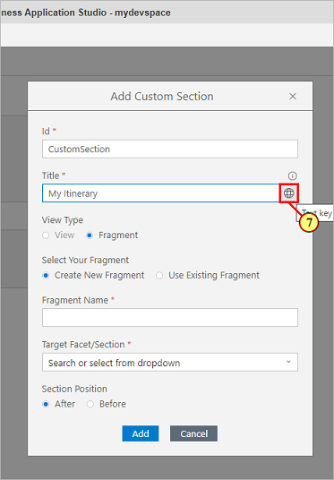

\(8\) In the dialog, Click button **Apply**.\
This will generate an **i18n text key** in order to make the entered text translatable.

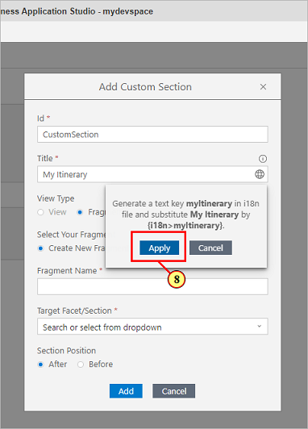

\(9\) Enter as Fragment Name: **CustomSection**\
(fragment name has to **match exactly** for some of the subsequent exercises to work properly)

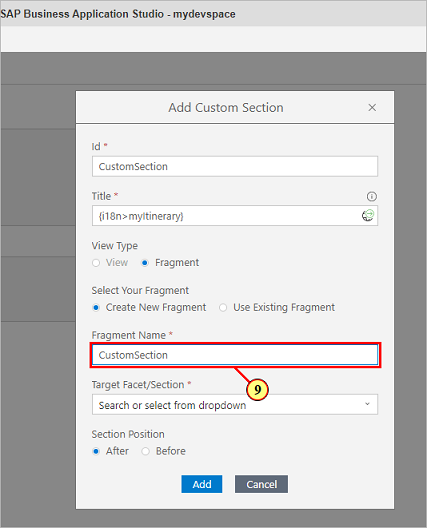

\(10\) Open the drop-down **Target Facet/Section**

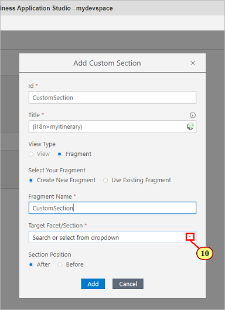

\(11\) Select 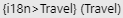.\
In combination with the Section Position (we leave it to **After**),\
we define where the custom section should be located on the Object Page.

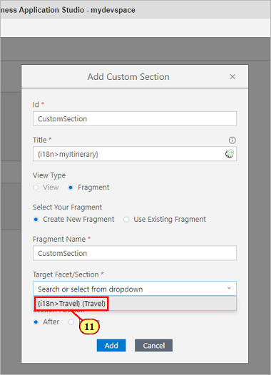

\(12\) Click  button 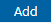.

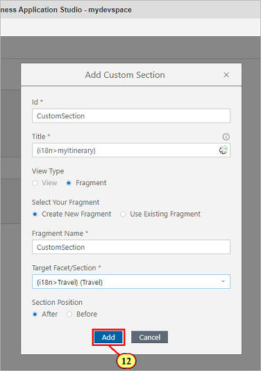

## Exercise 4.3 Replace Generated XML Fragment Content

\(13\) Click  icon . This will open up a new tab showing the content of the **generated xml fragment**.

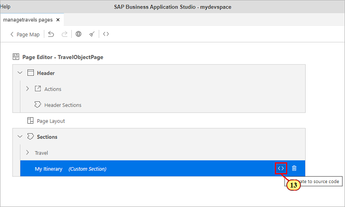

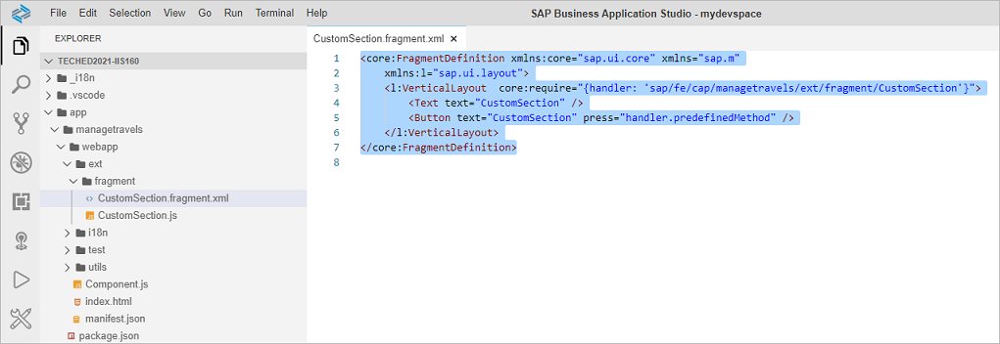

 Replace the content of file **CustomSection.fragment.xml** with the following xml snippet:

 ```js
<core:FragmentDefinition
  xmlns:core='sap.ui.core'
  xmlns='sap.m'
  xmlns:l='sap.ui.layout'
  xmlns:macros='sap.fe.macros'
>
 <VBox core:require="{handler: 'sap/fe/cap/managetravels/ext/fragment/CustomSection'}">  
  <MessageStrip
    text='All bookings for travel {TravelID} got confirmed by the agency.'
    showIcon='true'
    class='sapUiSmallMarginBottom'>
  </MessageStrip>     
  <l:Grid hSpacing='1' containerQuery='true'
    defaultSpan='L12 M12 S12'>
   <l:content>
   <macros:Table metaPath='to_Booking/@com.sap.vocabularies.UI.v1.LineItem'
      id='bookingTable'/>
   </l:content>
  </l:Grid>
 </VBox>
</core:FragmentDefinition>
```

\(14\) The xml fragment combines a SAPUI5 MessageStrip control with the building block **Table** from namespace **sap.fe.macros**.\
Only two properties are defined:

- the table control's **identifier**
- **metaPath** defining the relative path from the current page's context (entity **Travel**) to the **@UI.LineItem** annotation of the associated entity **Booking**.

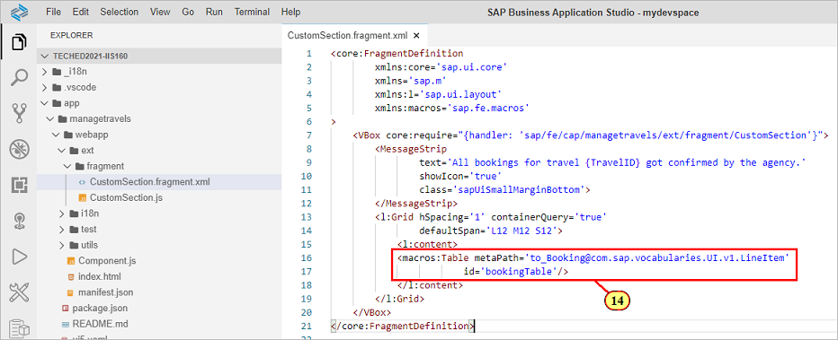

## Exercise 4.4 Testing the building block

Switch to the preview browser tab of the app.\
The object page now shows the custom section with the message strip control and the table building block.\
We will now check whether it behaves exactly as the original booking table from the object page section that was replaced.

\(15\) Click  button 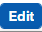.

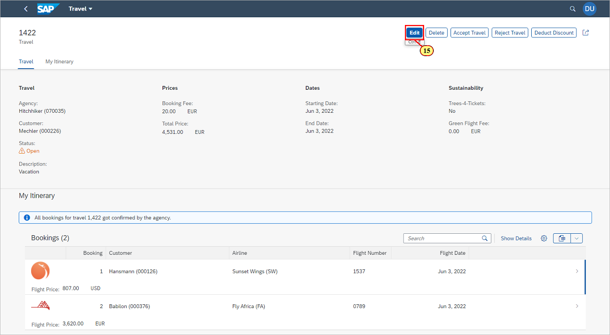

We can see that the table building block follows the edit state of the page.\
Let us check whether the edit flow is also working as expected.\
\(16\) Open the input help for field **Flight Number** via icon 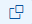.

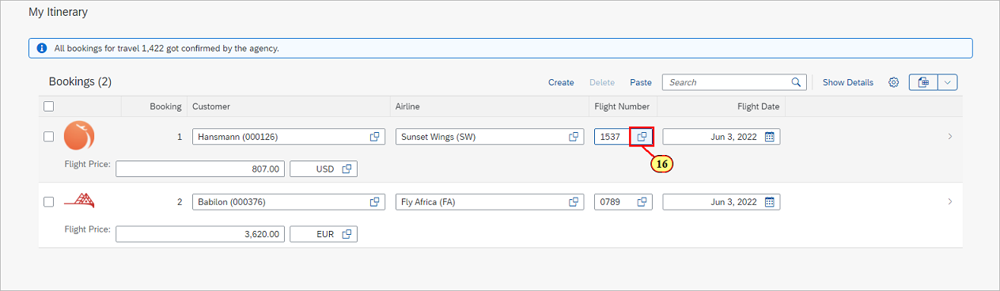

\(17\) In the Value Help dialog, Select a list entry and confirm selection by clicking button \(18\) .

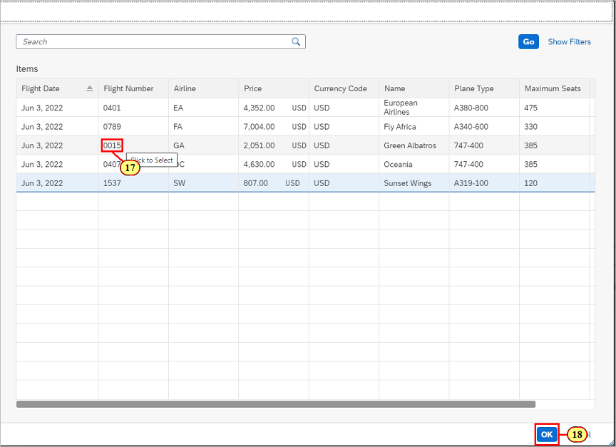

\(19\) In the footer bar, the notification  shows that the draft has been automatically updated.

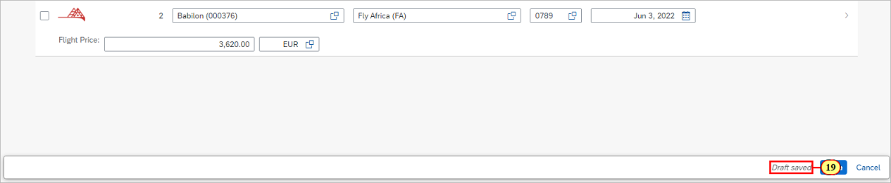

\(20\) Click  button  to activate the changes.

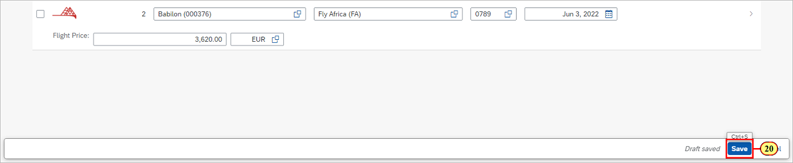

The table switches again to display mode, following the page's edit state.\
Finally, we check whether navigation as configured in the manifest routing is also in place.\
\(21\) Click on a list item. This will navigate to the sub object page.

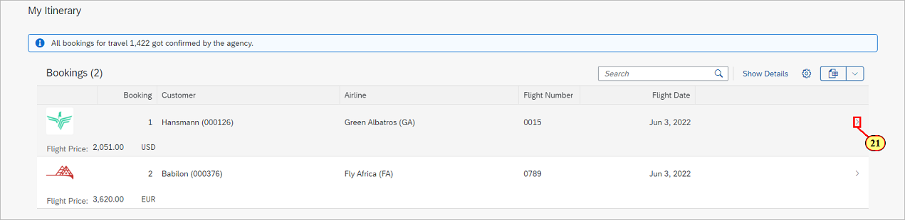

\(22\) Navigate back to the object page by clicking button .

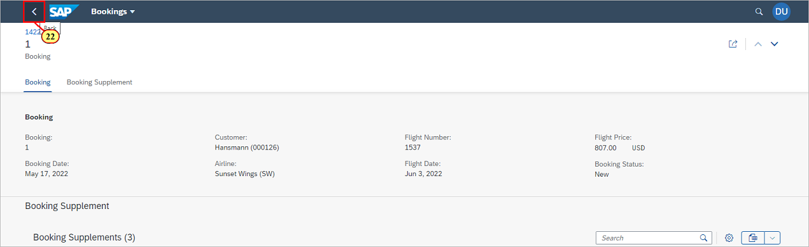

## Exercise 4.5 Adding a Side Effect

In exercise 4.4, we tested the building block's editing behaviour by changing the flight number of a booking.\
As selecting another flight number automatically updates the corresponding flight price, the expectation would be that\
field **Total Price** shown in the field group **Prices** is updated when the draft is saved.

In order to achieve this, let us add a **side effect** to the booking table's column **Flight Number**.\
In the service entity **Booking**, the corresponding property is named **ConnectionID**.

Open file **app/field-control.cds** (23) and scroll to section **Exercise 4.5: Add side effect on ConnectionID** (24)

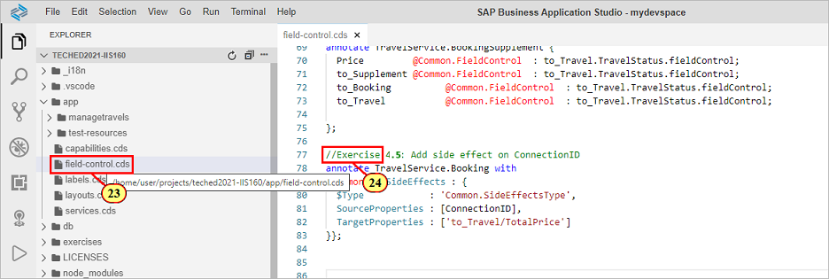

Insert the following snippet:

```js
annotate TravelService.Booking with 
@Common : {SideEffects #ConnectionID: {
  $Type            : 'Common.SideEffectsType',
  SourceProperties : [ConnectionID],
  TargetProperties : ['to_Travel/TotalPrice']
}};
```

Please note for the annotation's property **TargetProperties**, property **TotalPrice** of the parent entity is targeted via association **to_Travel**.\
Switch to the preview browser tab of the app.

(25) Repeat **exercise steps (15) to (17)** in order to select a different Flight Number.

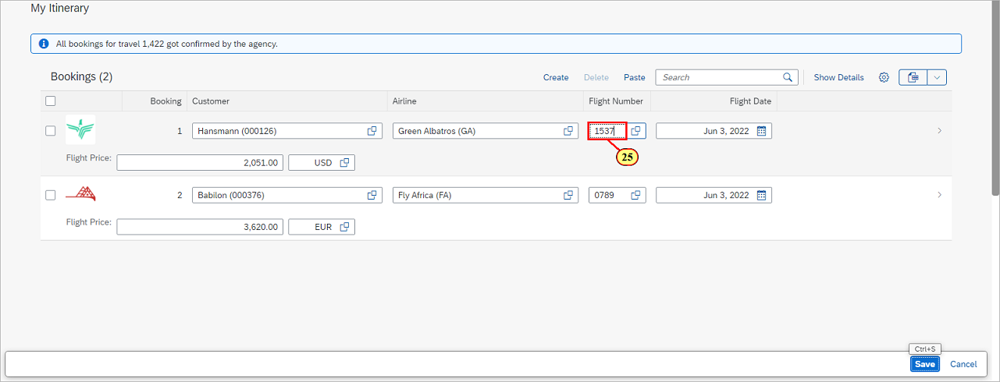

(26) Check that the Total Price in field group **Prices** is updated.

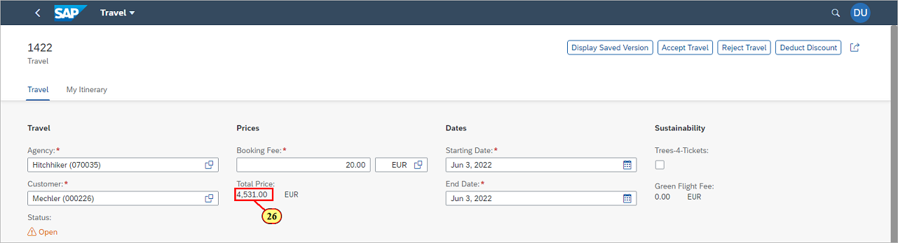

## Summary

You've now successfully added a **custom section** via the **SAP Fiori tools Page Map**, and used the **table building block** in the extension.\
You have tested the building block's **editing and navigation behaviour**, and defined a **side effect** showing that editing data in the table influences data shown in other areas of the app.

Continue to - [Exercise 5 - Adding a Micro Chart to the Table Building Block](../ex5/README.md)
