# Exercise 6 - Flexible Programming Model: Using the Chart Building Block

In this exercise, we will learn how to use the **chart building block** in an **extension point** of the Fiori elements object page floorplan.\
We will enhance the service with corresponding annotations and add the building block to the XML fragment of the custom section.\
We will also learn how to implement the chart's **selection event handler** in order to show additional information on the UI.

## Exercise 6.1 Extending the Service Definition

The chart building block to be added to the custom section will show aggregated **bookings per customer for all airlines**, complementing the **Customer VIP Status**
scenario.\
At first, we need to enhance the service definition by adding a view and extending the Travel entity with an association.

\(1\) In SAP Business Application Studio, open file **db/schema.cds**.

\(2\) Scroll to section **Exercise 6: Using the Chart Building Block** and add the following code snippet:

```js
define view BookedFlights as select from Booking left join Airline on Airline.AirlineID = Booking.to_Carrier.AirlineID  {
  key to_Customer.CustomerID as to_Customer_CustomerID, key AirlineID, to_Customer.LastName as LastName, BookingUUID, Name, VIPCustomerBookings, to_Travel
};

extend Travel with {
  to_BookedFlights : Association to many BookedFlights on to_BookedFlights.to_Travel = $self @readonly;  
};
```

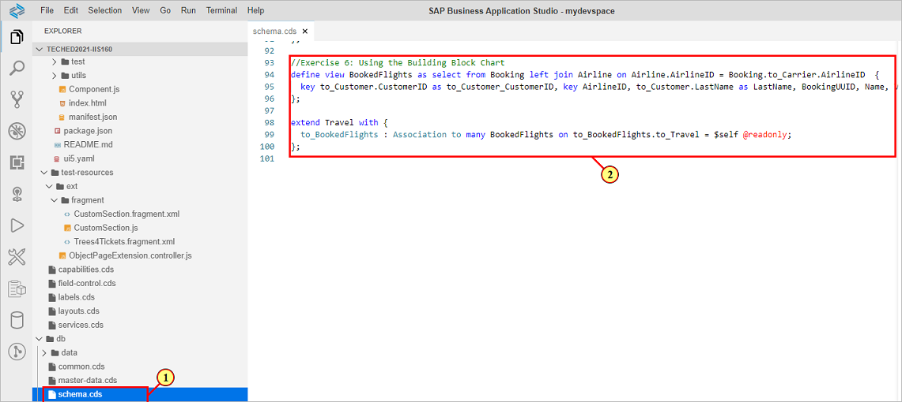

## Exercise 6.2 Adding Aggregation Capabilities to the Entity Container

In order to retrieve data, the chart uses the **oData V4 aggregate transformation capabilities**.\
At first, we need to enable [aggregation capabilities](http://docs.oasis-open.org/odata/odata-data-aggregation-ext/v4.0/cs01/odata-data-aggregation-ext-v4.0-cs01.html#_Toc378326316) by annotating view **BookedFlights** accordingly.

\(3\) Open file **app/capabilities.cds** .

\(4\) Scroll to section **Exercise 6: Add Aggregation Capabilities** and enter the following code snippet:

```js
annotate TravelService.BookedFlights with @(
  Aggregation.ApplySupported: {
    $Type : 'Aggregation.ApplySupportedType',
    Transformations : [
        'aggregate',
        'groupby'
    ],
    Rollup : #None,
    GroupableProperties : [
        to_Customer_CustomerID, AirlineID
    ],
    AggregatableProperties : [
        {
            $Type : 'Aggregation.AggregatablePropertyType',
            Property : BookingUUID 
        },
    ],
  },
  Analytics.AggregatedProperties : [{
    Name : 'CountFlights',
    AggregationMethod : 'countdistinct',
    AggregatableProperty : BookingUUID,
    ![@Common.Label] : 'Booked Flights per Airline',
  }]);
```

Annotation explanation:

- Collection **Transformations** lists all supported transformations for the entity container.
- Collection **GroupableProperties** contains the properties of the annotated entity that can be used in a **groupby** transformation.
- Collection **AggregatableProperties** contains the properties of the annotated entity that can be used for aggregation
- Collection **Analytics.AggregatedProperties** defines the aggregate expression with an aggregation method for the aggregatable property.
  
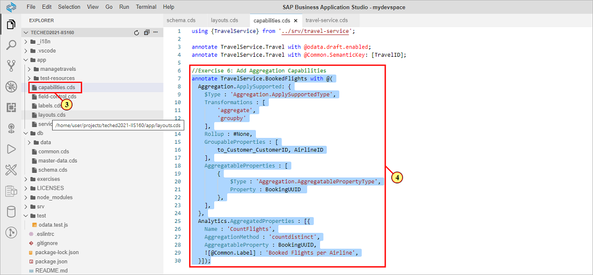

## Exercise 6.3 Adding the @UI.Chart Annotation

Now we will add annotation **@UI.Chart** to view **BookedFlights**\
The annotation defines the **chart type**, the **measure** and the **dimensions** to be used for visualization of the aggregated data.

\(5\) Open file **app/layouts.cds**.

\(6\) Scroll to section **Exercise 6: BookedFlights entity Chart annotation** and enter the following code snippet:

```js
annotate TravelService.BookedFlights with @(
    UI : {
        Chart                            : {
            $Type               : 'UI.ChartDefinitionType',
            Title               : 'Total Bookings for Customer',
            Description         : 'Chart Description',
            ChartType           : #Column,
            Measures            : [CountFlights],
            Dimensions          : [to_Customer_CustomerID, AirlineID],
            MeasureAttributes   : [{
                $Type   : 'UI.ChartMeasureAttributeType',
                Measure : CountFlights,
                Role    : #Axis1
            }],            
            DimensionAttributes : [
              {
                $Type     : 'UI.ChartDimensionAttributeType',
                Dimension : to_Customer_CustomerID,
                Role      : #Category
            },         
            {
                $Type     : 'UI.ChartDimensionAttributeType',
                Dimension : AirlineID,
                Role      : #Series
            }
            ]
        }                
    } 
);
```

The aggregated property **CountFlights** is defined as the **measure*, properties **to_Customer_Customer_ID** and **AirlineID** are defined as the **grouping dimensions**.

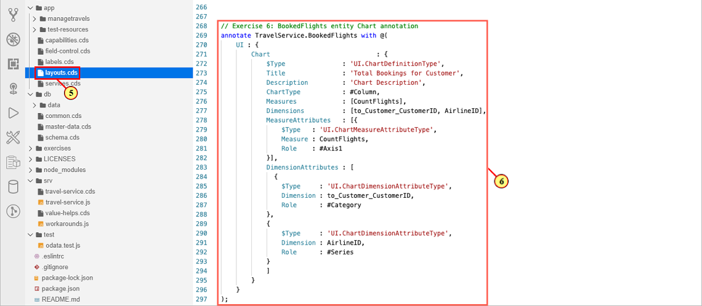

The aggregation result for the current Travel's bookings is enriched with aggregated bookings data for all other airlines.\
This is done in a custom read handler implementation in file **srv/travel-service.js** \(7\), section **Exercise 6: Custom Section Chart Building Block** (8).


## Exercise 6.3 Adding the Chart Building Block to the Custom Section

We will now add the **chart building block** to the custom section's **XML fragment**.

\(9\) Open file **app/managetravels/webapp/ext/CustomSection.fragment.xml**.

In the UI, the chart shall be shown next to the table in the same container, sharing the space mutually.

\(10\) Change the **default span** of the grid control to

```js
defaultSpan='L6 M12 S12'
```

\(11\) Add the chart building block into section ```<l:content> ``` of the XML fragment, just above the ```<macros:Table>``` definition.

```js
<macros:Chart
  id="chartDefault"
  contextPath="/Travel/to_BookedFlights"
  metaPath="@com.sap.vocabularies.UI.v1.Chart"
  personalization="Type,Item"
  selectionMode="Single"
>
</macros:Chart>
```

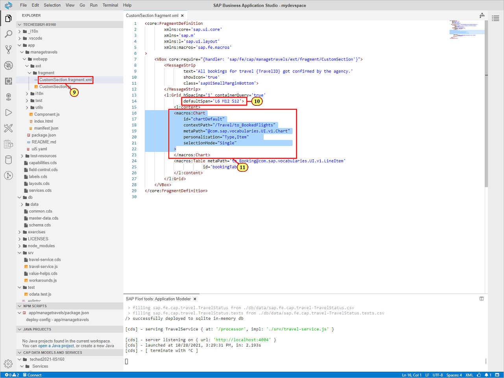

The properties defined for the building block chart are:

- **id** of the chart control
- **contextPath** defining the absolute path from root entity **Travel** and association **to_BookedFlights**
- **metaPath** defining the relative path to the UI.Chart annotation in the metamodel
- **personalization** for chart configuration options
- **selection mode** set to single selection

Switch to the browser preview window. The chart is shown.

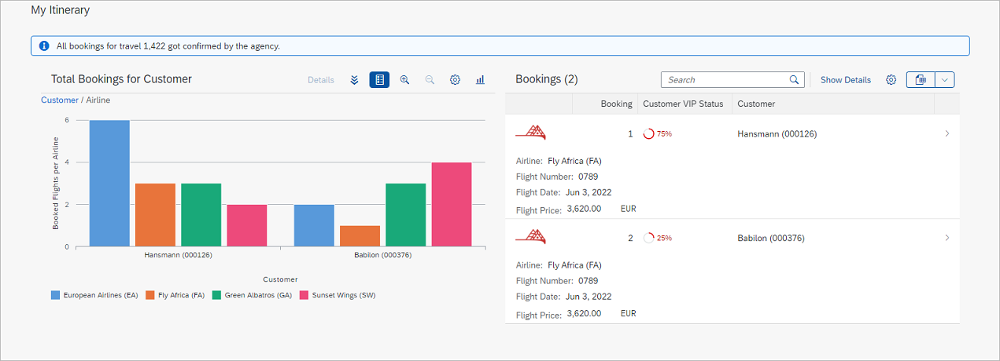

## Exercise 6.4 Implementing the Chart's Selection Change Handler

The **chart building block API** allows implementing a **selection change handler** which is triggered when a chart segment is selected.\
We will use the event to show additional information in a small popover.\
The **popover fragment sample** is provided in the project.\
We need to move it to the **app folder** in order to make usage of it.

 Open project folder **app/test-resources/ext/fragment**.\
 Drag and drop file **Popover.fragment.xml** \(12\) to folder **app/managetravels/webapp/ext/fragment** \(13\).

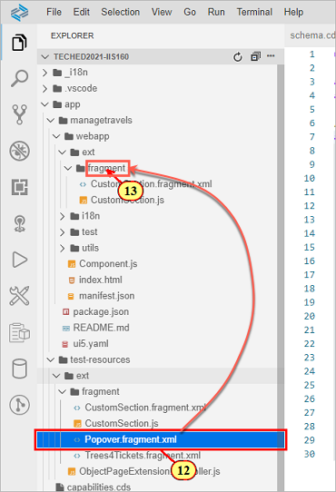

Now we need to define the **click event handler** for the chart.\
\(14\) Add the following xml snippet as an additional property of **macros:Chart** as shown in the screenshot below.

```js
  selectionChange="handler.onChartSelectionChanged"
```

We will now add the Popover fragment as a dependent control to the Custom Sections grid control.\
\(15\) Add the following xml snippet as shown in the screenshot below.

```js
  <l:dependents>
    <core:Fragment fragmentName="sap.fe.cap.managetravels.ext.fragment.Popover" type="XML"/>			
  </l:dependents>	
```

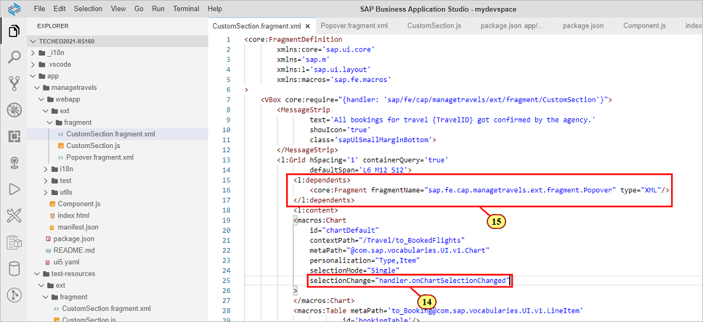

Now we need to implement the event handler \(16\)  in file **app/managetravels/webapp/ext/CustomSection.js** \(17\).\
The file was created along with the custom section we added in exercise 4.\
Replace the file's content with the following code snippet.

```js
sap.ui.define(["sap/ui/model/json/JSONModel"], function (JSONModel) {
  "use strict";

  return {
    onChartSelectionChanged: function (oEvent) {
      if (oEvent.getParameter("selected")) {
		// 
        this.editFlow
          .getView()
          .setModel(
            new JSONModel(oEvent.getParameter("data")[0].data),"popup");


        // get Popover from xml fragment dependents
        this._oPopover = oEvent.getSource().getParent().getDependents()[0];
        if (this._oPopover) {
		  // open popover at selected chart segment
          this._oPopover.openBy(
            oEvent.getParameter("data")[0].target
          );
        }
      }
    },
  };
});

```

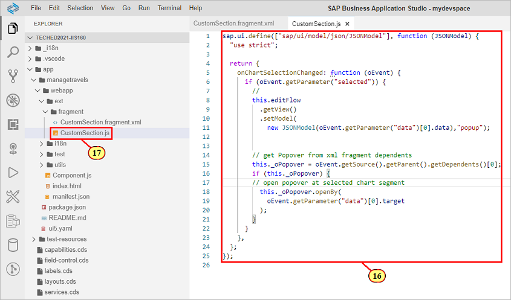

## Exercise 6.5 Testing the Chart's Event Handler

Switch to the preview browser tab.\
Select a chart segment in order to display the popover with additional information about the VIP Customer program per airline \(18\).

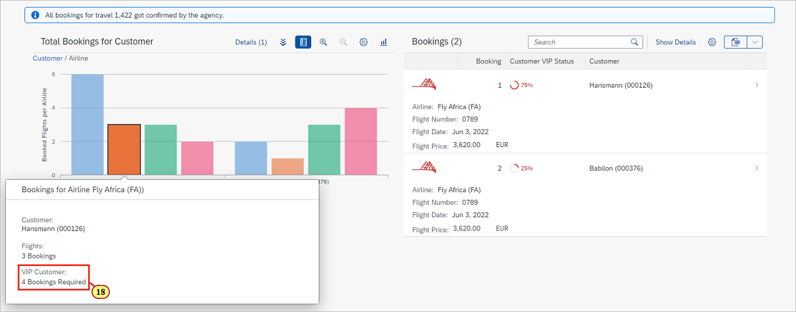

We will now check for other flight connections for the customer's preferred airlines according to the aggregated bookings shown in the chart.\
\(19\) Click  .

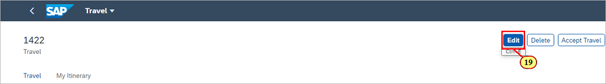

In this example, customer **Hansmann (000126)** has a preference for  **European Airlines** which is shown with the most bookings to in the chart.\
Clicking \(20\) opens a dropdown list with flight connections for the same flight date.

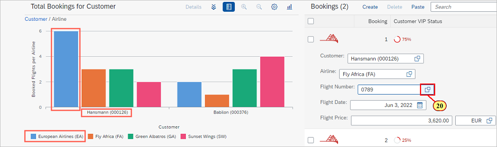


\(21\) Select a list item for the customer's preferred airline and confirm with .

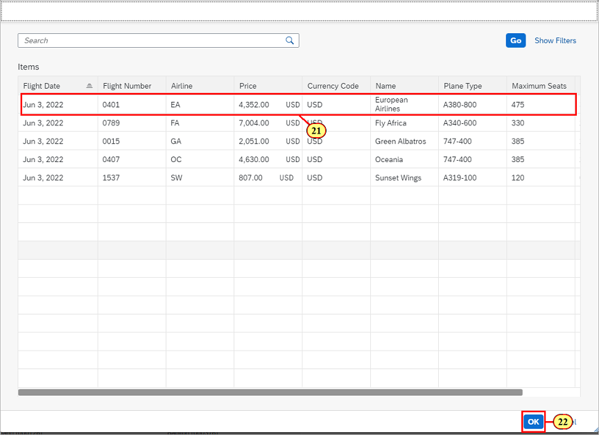

\(23\) Click .

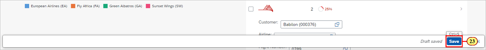

Verify that the both the chart \(24\) and the micro chart table column \(25\) have been updated.

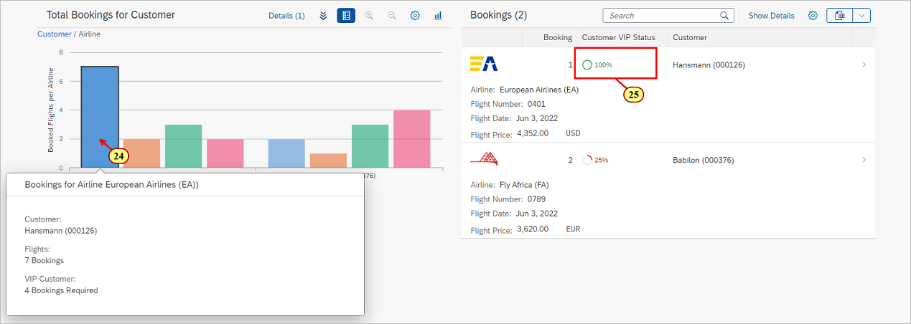

## Summary

We've now successfully added a @UI.Chart annotation to the service and added the **chart building block** to the custom section's XML fragment.\
We've implemented the chart's **event handler** in order to show a popover with additional information when a chart segment is selected.

Continue to - [Exercise 7 - Flexible Programming Model: Changing the Edit Flow by Implementing a Controller Extension](../ex7/README.md)