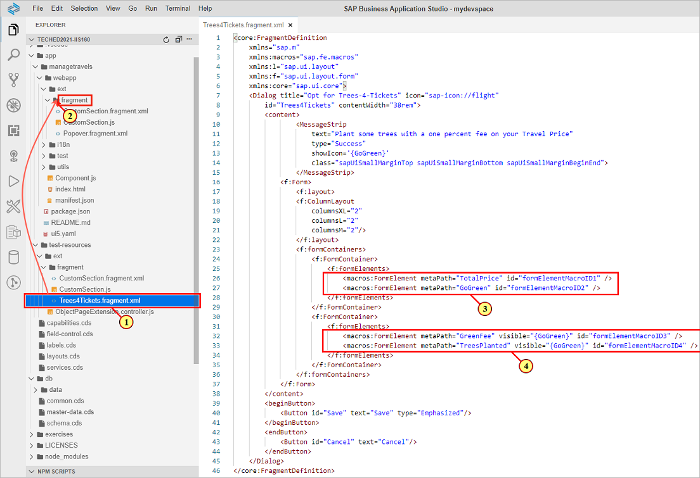
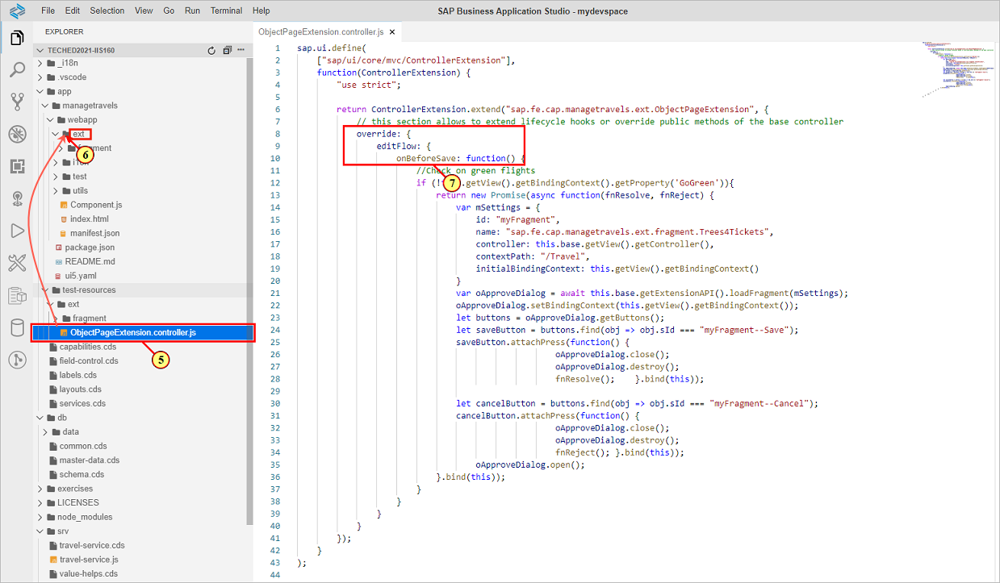
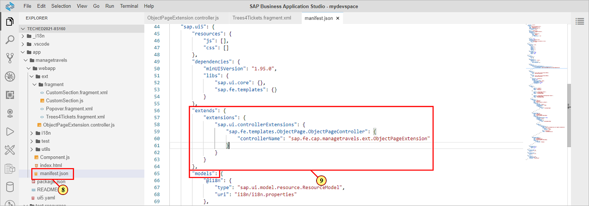
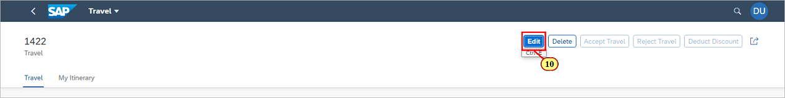
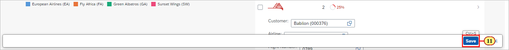
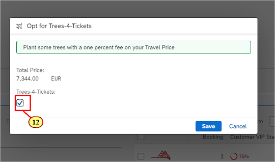
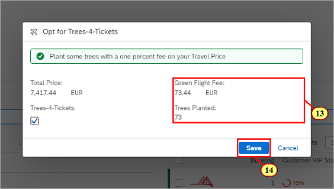
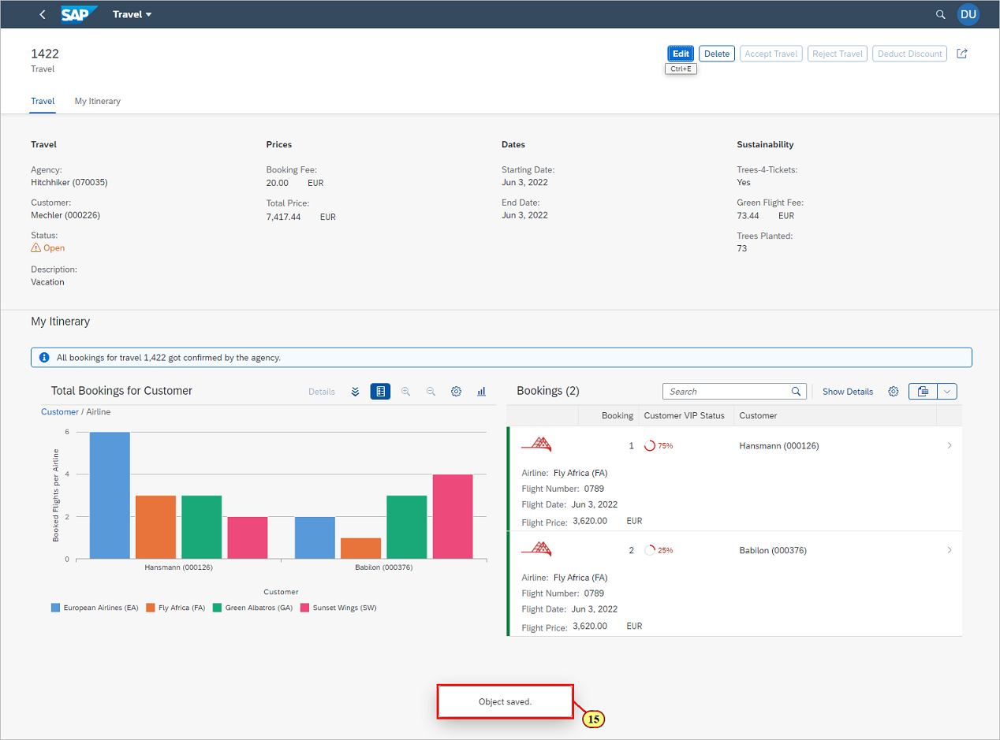

# Exercise 7 - Flexible Programming Model: Changing the Edit Flow by Implementing a Controller Extension

In this exercise we will learn how to change the **edit flow** of an app by implementing a [controller extension](https://ui5.sap.com/#/api/sap.fe.core.controllerextensions.EditFlow).\
In order to promote the new **green flight offering**, we will intercept the **save action** by overriding function **onBeforeSave** of the\
**edit flow API**, and execute some custom code in order to check whether Trees-4-Tickets has been selected for the travel.\
Additionally, we will make usage of the **form element building block** in order to display a form in a save dialog.

## Exercise 7.1 Move XML Fragment and Controller File to App Folder

The **xml fragment** containing the dialog definition and the **controller extension file** are provided in the project.\
We need to move it to the corresponding app's sub folders in order to make usage of them:

Open project folder **app/test-resources/ext/fragment**.\
Drag and drop file **Trees4Tickets.fragment.xml** \(1\) to folder **app/managetravels/webapp/ext/fragment** \(2\).



The XML fragment defines a dialog containing some UI5 controls and two buttons for saving and canceling.\
The most interesting part is the **form element building block** used in \(3\) and \(4\).

- with property **metaPath** pointing to a property of the current binding context, we can show the property as a form field, having the same behaviour as a standard field.
- property **visible** shows and hides the form elements depending on the path value. We are using boolean property **GoGreen** for that purpose, which is set when the checkbox is selected.


For the **controller extension**, we will now move the corresponding controller file to the app's sub folder:

Open project folder **app/test-resources/ext**.\
Drag and drop file **ObjectPageExtension.controller.js** \(5\) to folder **app/managetravels/webapp/ext** \(6\).\
Make sure the controller file is dropped to folder **ext**, not to sub folder **fragment** as the XML fragment we moved before.



In the controller file, the editFlow API function **onBeforeSave** is implemented \(7\).\
The **override function** is called when pressing the **Save** button on the object page, allowing to influence the save procedure.\
For more details about the override function, please refer to the [API reference](https://ui5.sap.com/#/api/sap.fe.core.controllerextensions.EditFlow%23methods/onBeforeSave).

## Exercise 7.2 Adding a Controller Extension to the Manifest

We now need to **register the controller extension** in the **application manifest**.\
\(8\) Open file **app/managetravels/webapp/manifest.json**.\
Scroll down to **section models**.\
**Right above of it**, enter the following snippet :

```js
"extends": {
    "extensions": {
        "sap.ui.controllerExtensions": {
            "sap.fe.templates.ObjectPage.ObjectPageController": {
                "controllerName": "sap.fe.cap.managetravels.ext.ObjectPageExtension"
            }
        }
    }
},
```

\(9\) Compare the inserted snippet with the screenshot below.


## Exercise 7.3 Testing the Controller Extension

\(10\) Switch to the preview browser tab and click .



\(11\) Make sure that the Trees-4-Tickets flag is not set in the sustainability field group, then press .



The dialog is shown.\
\(12\)  Select check box **Trees-4-Tickets**.\
This triggers an automatic draft save in the background.



\(13\) Additional form fields with updated data are shown.

\(14\) Click .



\(15\) The object is saved and the UI switches back to display mode.



## Summary

You've now successfully completed the hands-on workshop. Congratulations!
